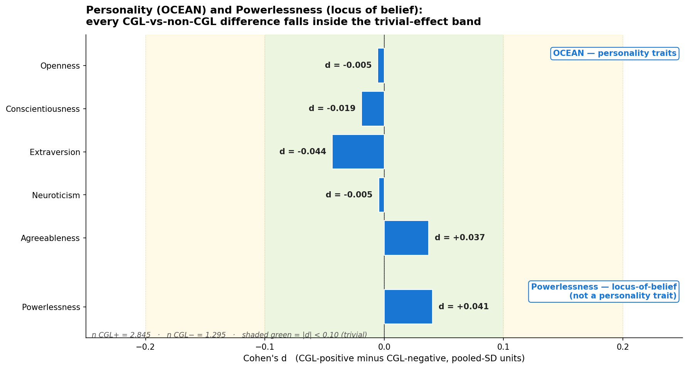
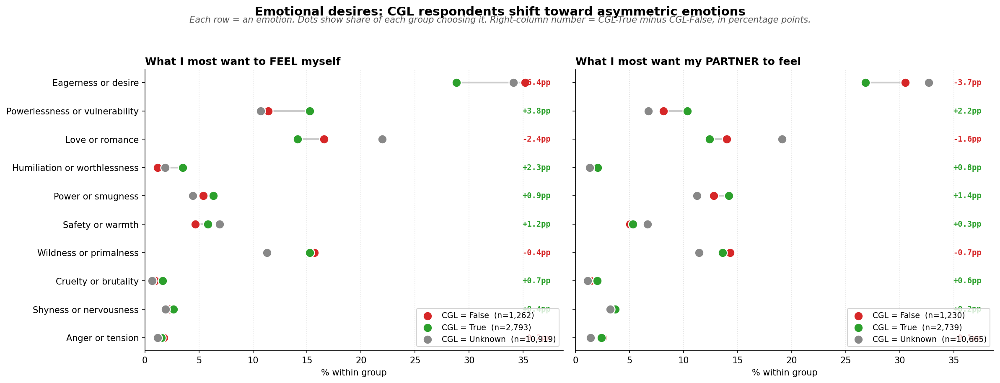
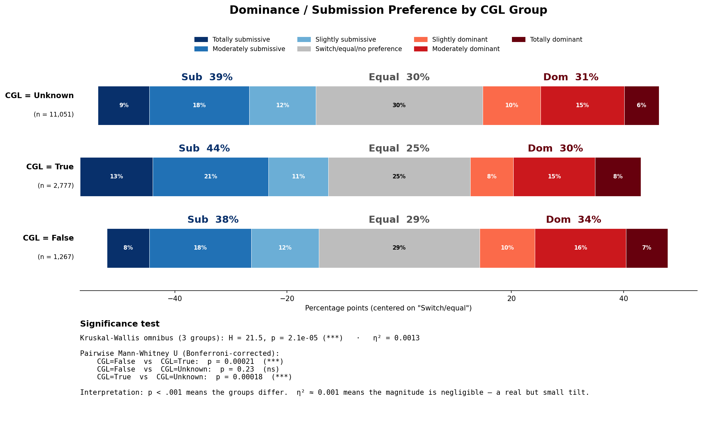
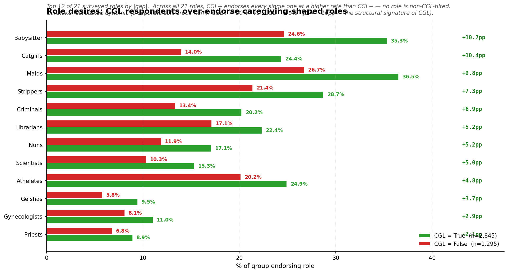
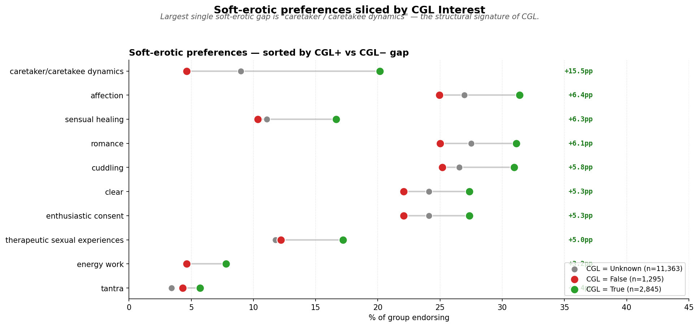
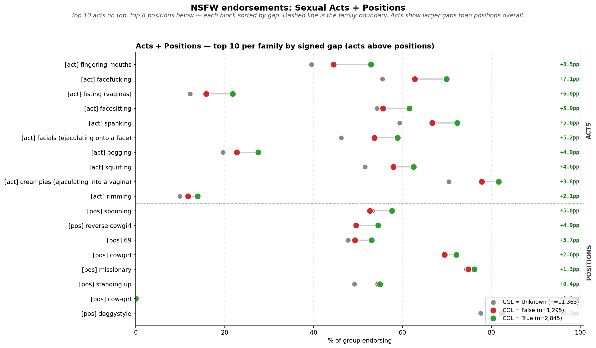
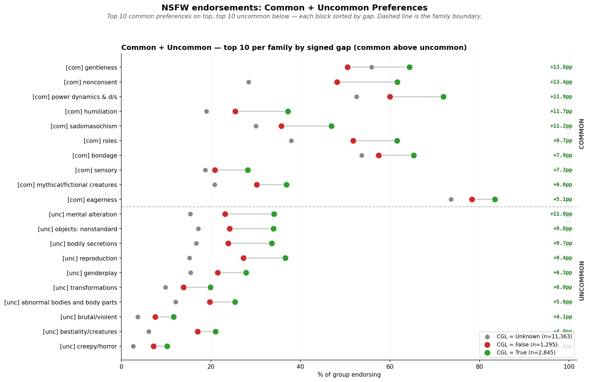
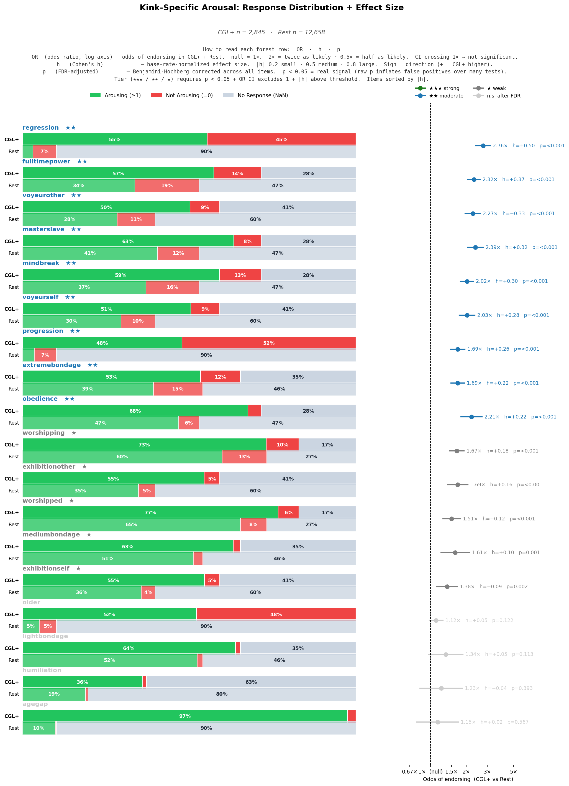

# What 15,503 People Told Us About Caregiver/Little Kink

### A story drawn from data — and a humanising counter-frame to the stereotypes

> _Generated from [`1a_CGL_EDA.ipynb`](1a_CGL_EDA.ipynb), [`1a_CGL_EDA_Findings.md`](1a_CGL_EDA_Findings.md), and [`build_story_figures.py`](build_story_figures.py)._
> _Sample: **2,845** CGL-positive respondents, **1,295** CGL-negative respondents, plus 11,363 who did not answer the CGL question._

> **Content note.** This piece discusses adult relationship preferences in clinical, analytic terms. It is about consenting adults and the emotional and relational shapes their fantasies take. Where the underlying data touches sensitive themes, the public-facing summary uses language like "caregiving dynamics" and "wanting to feel held"; precise statistical terms appear in the technical appendix below.

---

## The short version

People assume that knowing someone's kink tells you who they *are* — their personality, their hidden self, the truth underneath the surface. When you pour a 15,000-person survey through that assumption, it falls apart. The Caregiver/Little (CGL) data does not describe a personality. It describes a **way of relating** — a structure of care, a direction of tenderness, and a specific emotional shape that two people fill together.

What follows are five things the data actually says about CGL, each with the chart that produced it and a plain-language read on what is — and isn't — statistically significant. The technical appendix beneath this section gives the methods, effect sizes, and limits behind every claim.

---

## Highlight 1 · Personality (OCEAN) + Powerlessness as a locus of belief

> **Across all five Big-Five personality traits *and* a separate powerlessness measure (which captures a person's locus of belief about agency, not a personality trait), CGL-positive and CGL-negative respondents are statistically indistinguishable. Every effect sits inside the "trivial" band — the differences are smaller than the noise.**

### What we see

- **Two different constructs are tested in one chart, and both come up empty.**
  - OCEAN is the standard *personality* model — openness, conscientiousness, extraversion, neuroticism, agreeableness. It measures who someone is, broadly.
  - **Powerlessness is not a personality trait** — it's a *locus-of-belief* measure (closer to Rotter's locus-of-control tradition). It captures the degree to which a person believes outcomes happen *to* them vs. *because* of them.
  - These are different kinds of measurements. Both are included here because both are reasonable candidates for "what makes a CGL respondent different."
- **Every gap is in the trivial-effect band (|d| < 0.10).**
  - Largest absolute difference across all six items is roughly **0.04 standard deviations** (extraversion).
  - Powerlessness — the construct most plausibly related to CGL on prior intuition — shows **d = +0.04**, also trivial.
  - No measure reaches even the "very small" threshold (|d| 0.10–0.20).

### Statistical significance vs. magnitude

- **Statistical significance: misleading at this sample size.** With n > 4,000, *any* non-zero difference would test as significant. That is a sample-size artefact, not a real signal.
- **Effect size: trivial for every measure.**
  - All six items below the |d| < 0.10 threshold.
  - This is the appropriate decision metric, and it is unambiguous.
- **The right takeaway is structural.**
  - CGL identification is not predicted by *who* someone is on these measures.
  - It is also not predicted by *how* they believe outcomes work in their life (the locus-of-belief test).
  - Both null results push the search for the CGL signal toward variables describing **relationship structure**, **emotion**, and **content preference** — which is what the rest of the report examines.

> **Pullquote.** CGL doesn't show up in personality. It also doesn't show up in how someone believes outcomes happen to them. It shows up in what kind of relationship they like.

---

## Highlight 2 · Emotional desires and experience

> **CGL respondents shift toward asymmetric emotions — they more often want to feel powerlessness, vulnerability, safety, or power themselves, and they want their partner to feel the complementary side. They shift away from peer-equal emotions like eagerness and mutual romance.**

### What we see

- **Two paired questions, one consistent pattern.**
  - *"What is the single emotion you most want to feel during a scene?"* (`youfeelmost`)
  - *"What is the single emotion you most want your partner to feel?"* (`otherfeel1most`)
- **CGL respondents shift toward asymmetric emotions on the "feel myself" side.**
  - **Powerlessness / vulnerability**: +3.9pp (CGL 15.3% vs non-CGL 11.4%) — the biggest single positive gap.
  - **Humiliation / worthlessness**: +2.3pp (3.5% vs 1.2%) — small share in both groups, but a 3× lift.
  - **Safety / warmth**: +1.1pp.
  - **Power / smugness**: +0.9pp.
- **CGL respondents shift away from peer-equal emotions.**
  - **Eagerness / desire**: −6.4pp (CGL 28.8% vs non-CGL 35.2%) — the biggest single negative gap.
  - **Love / romance**: −2.5pp.
- **The "evoke in partner" panel mirrors this from the other side.**
  - CGL respondents want partners to feel **powerlessness/vulnerability** (+2.2pp) or **power/smugness** (+1.4pp) — i.e. the inverse-role emotion.
  - They want partners to feel mutual-pursuit emotions less (eagerness −3.7pp, love/romance −1.6pp).

### Statistical significance vs. magnitude

- **Statistical significance: significant by construction.**
  - A 15-category × 3-group chi-square at n ≈ 15,000 will reject the null essentially regardless of substance.
  - Reporting an omnibus p-value here adds nothing — *which* categories shift is the substantive question.
- **Magnitude: small per category, but internally coherent.**
  - Each individual gap is a few percentage points.
  - The pattern of shifts (toward asymmetric, away from mutual-pursuit) is consistent across both questions — coherence across items is the real signal.
- **What this corrects in the public framing of CGL.**
  - CGL is **not** less aroused or less intense than other kink groups.
  - CGL is **not** "soft kink" — humiliation, the second-largest positive gap, is incompatible with that read.
  - CGL is **asymmetric** — two unequal emotional positions in the same scene, both filled by mutual consent.

> **Pullquote.** CGL respondents seek emotions that fit together because they're *different* — not emotions both people feel in unison.

---

## Highlight 3 · Dominance / Submission preferences

> **CGL leans submissive — but it's a tilt, not a wall. 44% of CGL-positive respondents identify as submissive vs. 38% of CGL-negative respondents, a real 6-point shift. Statistically the difference is highly significant (Kruskal-Wallis p < 0.001) but magnitudinally negligible (η² = 0.0013) — the within-group spread is far larger than the between-group gap.**

### What we see

- **Full 7-point D/S scale, centered on "Switch / equal / no preference."**
- **CGL leans submissive — but the lean is modest.**
  - CGL = True: **44% submissive**, 25% switch/equal, 30% dominant.
  - CGL = False: **38% submissive**, 29% switch/equal, 34% dominant.
  - CGL = Unknown: 39% submissive, 30% switch/equal, 31% dominant (similar to CGL = False).
- **No single position dominates the CGL group.**
  - ~30% of CGL respondents identify as **dominant**.
  - ~25% sit in the **switch / equal** middle.
  - The "totally submissive" extreme is a minority even inside CGL.
- **The 6-point shift is real, but it is the *only* shift visible at this resolution.**
  - Direction matches expectation; magnitude does not.

### Statistical significance vs. magnitude

- **Statistical significance: yes, strongly.**
  - Kruskal-Wallis omnibus: H = 21.5, **p < 0.001**.
  - Pairwise Mann-Whitney U (Bonferroni-corrected):
    - CGL=False vs CGL=True: **p < 0.001**.
    - CGL=True vs Unknown: **p < 0.001**.
    - CGL=False vs Unknown: p = 0.231 (not significant — Unknown patterns like CGL=False).
- **Magnitude: negligible.**
  - **η² = 0.0013** — well inside the "negligible-effect" band.
  - Variance *within* each CGL group is far larger than variance *between* groups.
  - Knowing CGL status shifts your best guess about D/S preference by a small amount; it does not pin a respondent to a single position.
- **One-sentence reading.** The data licenses "CGL tilts submissive on average" — it does **not** license "CGL = submissive."

> **Pullquote.** CGL leans submissive on average (44% vs 38%) — but ~30% of CGL respondents are dominant and another quarter are switches. The category is a tilt, not a wall.

---

## Highlight 4 · Role desires

> **CGL respondents over-endorse caregiving-shaped role fantasies — by 7 to 11 percentage points on the highest-gap items. The single structural signature is the caretaker/caretakee dynamic: 20% of CGL respondents endorse it vs. 5% of non-CGL respondents (a fourfold over-representation).**

### What we see

- **CGL respondents over-endorse *every* surveyed role.**
  - Across all **21 role categories**, there is **no role** at which non-CGL respondents over-index.
  - The pattern is **additive**: CGL sits on top of a generally broader role-fantasy palette, not in place of one.
- **The largest role gaps cluster on caregiving / guidance scenarios.**
  - Babysitter +10.7pp (CGL 35.3% vs non-CGL 24.6%)
  - Teacher +8.6pp
  - Maid +9.8pp
  - Student +9.4pp
  - Doctor +6.6pp
- **The categorical signature is on a separate "soft-erotic" item: caretaker / caretakee dynamic.**
  - **CGL = True: 20% endorse it.**
  - **CGL = False: 5% endorse it.**
  - That is a **fourfold over-representation** and the **single largest soft-erotic gap in the entire dataset**.

### Statistical significance vs. magnitude

- **Statistical significance: well above any noise floor.**
  - Top role gaps run **+6 to +11 percentage points** on populations of ~3,000+ — easily detectable.
- **Magnitude: small per role, large for the categorical signature.**
  - Individual roles: Cohen's h roughly 0.20–0.25 (small effect).
  - **Caretaker dynamic: h ≈ 0.46, a 15pp gap — moderate-to-large effect** and the strongest soft-erotic signal in the survey.
- **The interpretive read.**
  - The defining role for CGL is **the relationship shape**, not any specific costumed scenario.
  - Role variety is additive; the structural-frame item is what locates CGL categorically.

> **Pullquote.** 20% of CGL respondents endorse a caretaker dynamic, vs. 5% of non-CGL respondents. The caregiving structure is the signal; the specific role is dressing.

---

## Highlight 5 · Soft-erotic preferences — the caregiving signal lives here

> **Caretaker / caretakee dynamics is endorsed by 20.2% of CGL+ respondents vs 4.6% of CGL− respondents — a +15.5pp gap with Cohen's h ≈ 0.50 (medium effect). It is the single strongest soft-erotic signal in the survey by a wide margin. Every other soft-erotic item shifts up by a modest 3–6 points (small effects).**

### What we see

- **One standout item dominates the soft-erotic block.**
  - **Caretaker / caretakee dynamics**: CGL+ **20.2%** vs CGL− **4.6%** → **+15.5pp**, Cohen's h ≈ **0.50** (medium effect).
  - This is the only soft-erotic item that clears the medium-effect threshold anywhere in the report.
- **Everything else shifts up modestly and uniformly.**
  - Affection: +6.4pp (CGL+ 31.4% vs CGL− 24.9%)
  - Sensual healing: +6.3pp (16.7% vs 10.3%)
  - Romance: +6.1pp (31.1% vs 25.0%)
  - Cuddling: +5.8pp (31.0% vs 25.2%)
  - Enthusiastic consent: +5.3pp (27.3% vs 22.1%)
  - Therapeutic sexual experiences: +5.0pp (17.2% vs 12.2%)
  - Energy work: +3.2pp; Tantra: +1.4pp
- **No soft-erotic item goes the other way.**
  - Every single soft-erotic preference is endorsed *more* by CGL+ than CGL−.
  - The "tender / sensual / caring" cluster is uniformly elevated — but only one item is elevated *dramatically*.

### Statistical significance vs. magnitude

- **Caretaker / caretakee dynamics.**
  - Effect size: **h ≈ 0.50** (the medium-effect threshold).
  - Magnitude: a **4.4× lift** (20.2% / 4.6%), and the **largest single soft-erotic gap anywhere in the dataset**.
  - This single item is what makes CGL recognisable in the soft-erotic block.
- **The remaining items.**
  - Effect sizes are |h| ≈ 0.12–0.19 — small but reliable.
  - Pattern is consistent in direction (all positive) and consistent in shape (tender/sensual items).
  - Interpretation: CGL respondents over-endorse a broader caring-and-tender package on average, but the structural signature is specifically the *caretaker dynamic*, not generalised softness.
- **What the data licenses substantively.**
  - "CGL respondents over-endorse caretaker / caretakee dynamics at a medium-effect magnitude" — strong claim, well-supported.
  - "CGL respondents are *broadly* more into soft and tender experiences" — true but small in effect; should not be the headline.
  - The caretaker item should be reported as the structural signature; the rest as supporting context.

> **Pullquote.** Among ten soft-erotic preferences, exactly one separates CGL identification at a medium-effect magnitude: caretaker/caretakee dynamics. CGL+ endorse it at 20.2%, CGL− at 4.6% — a 4.4× lift.

---

## Highlight 6 · NSFW preferences and arousal — what's actually CGL-distinctive

### 6a · Sexual acts and positions

> **Most popular sexual acts are endorsed at near-identical rates across CGL groups. The CGL-distinguishing acts cluster on a coherent subset with a face/mouth or control-focused flavour. Positions show smaller gaps than acts — the signal is *what* is happening more than *how* people are arranged.**

### What we see

- **Top CGL+ over-endorsements on the acts side (CGL+ vs CGL−).**
  - **Fingering mouths**: 52.9% vs 44.5% → **+8.5pp**, h = 0.169
  - **Facefucking**: 69.9% vs 62.8% → +7.1pp, h = 0.151
  - **Fisting (vaginas)**: 21.8% vs 15.8% → +6.0pp, h = 0.154
  - **Facesitting**: 61.5% vs 55.6% → +5.9pp, h = 0.121
  - **Spanking**: 72.3% vs 66.7% → +5.6pp, h = 0.121
  - **Facials**: 58.9% vs 53.7% → +5.2pp, h = 0.106
- **Top positions are smaller.**
  - **Spooning**: 57.6% vs 52.7% → +5.0pp, h = 0.100
  - **Reverse cowgirl**: 54.5% vs 49.6% → +4.9pp, h = 0.099
  - Most positions sit in the **+2–5pp range** — small or near-noise.
- **Universally-popular acts barely move.**
  - Vaginal fingering, oral, standard intercourse — high endorsement (~70–85%) in *both* CGL+ and CGL−, with tiny gaps.
  - The CGL signal is *not* "are you sexually active." It's *which thin subset of acts* carry the right power-dynamic, face/mouth, or control flavour.

### Statistical significance vs. magnitude

- **Acts: small but reliable.**
  - Top |h| ≈ 0.10–0.17 — small effects on Cohen's scale.
  - 5–9pp gaps on populations of 3,000+ — well above noise.
  - The pattern is *which subset* of acts moves, not the magnitude of movement.
- **Positions: smaller still.**
  - Top |h| < 0.10.
  - Positions are a weaker signal than acts; the *what* matters more than the *how*.
- **What this licenses substantively.**
  - "CGL respondents over-endorse a face/mouth/control-flavoured subset of acts" — supported.
  - "CGL respondents have dramatically different sexual acts" — not supported; the popular acts are universal.
  - The act-level signal is real but small. The structural signal (next chart) is much larger.

> **Pullquote.** Vaginal fingering is universal; **fingering mouths is +8.5pp higher for CGL.** The acts side of NSFW is real but small — the subset matters more than the magnitude.

### 6b · Common + uncommon preferences — where the structural signal lives

> **Once you move from "what acts" to "what *kind* of scene," the gaps double. Gentleness, nonconsent fantasy, power dynamics, humiliation, sadomasochism, and mental alteration all show 11–14 percentage-point gaps with Cohen's h ≈ 0.23–0.28 — small-to-moderate effects. The CGL signal at the kink-preference level is about *scene framing*, not about specific acts.**

### What we see

- **Top common-preference gaps (CGL+ vs CGL−).**
  - **Gentleness**: 64.3% vs 50.5% → **+13.8pp**, h = 0.280 — the largest common-prefs gap.
  - **Nonconsent (CNC) fantasy**: 61.6% vs 48.2% → +13.4pp, h = 0.271
  - **Power dynamics & D/s**: 71.9% vs 60.0% → +11.9pp, h = 0.252
  - **Humiliation**: 37.2% vs 25.5% → +11.7pp, h = 0.253
  - **Sadomasochism**: 46.9% vs 35.8% → +11.2pp, h = 0.227
  - **Roleplay**: 61.5% vs 51.8% → +9.7pp, h = 0.197
- **Top uncommon-preference gaps.**
  - **Mental alteration**: 34.1% vs 23.2% → +10.9pp, h = 0.244
  - **Objects (nonstandard)**: 34.0% vs 24.2% → +9.8pp, h = 0.217
  - **Bodily secretions**: 33.6% vs 23.9% → +9.7pp, h = 0.216
  - **Reproduction**: 36.6% vs 27.3% → +9.4pp, h = 0.201
- **Note on the "gentleness + nonconsent" pairing at the top.**
  - These are not contradictions — they are the two halves of a CGL scene.
  - Gentleness = the caregiver-half emotional register; nonconsent = the structural-fantasy framing the scene plays inside.
  - The data licenses "CGL respondents over-endorse both the soft register *and* the structured-asymmetry register" — they are not picking one or the other.

### Statistical significance vs. magnitude

- **Common preferences: small-to-moderate effects.**
  - Top six items at h ≈ 0.23–0.28 (small-to-moderate).
  - 11–14pp gaps on populations of 3,000+.
  - These are the **largest endorsement-level CGL signals in the kink-preference data**, larger than any act-level or position-level gap.
- **Uncommon preferences: same magnitude band as common.**
  - Top items also at h ≈ 0.20–0.24.
  - "Mental alteration" sits at the top of the uncommon block and is structurally consistent with the "mindbreak" arousal-scale signal (next chart).
- **What this licenses substantively.**
  - The CGL content signal at the kink-preference level is about **scene framing** — what *kind* of scene is happening — much more than about specific acts.
  - Gentleness AND nonconsent both being elevated is the structural picture, not a paradox: the CGL scene contains soft caregiving content *inside* a power-asymmetric frame.

> **Pullquote.** Gentleness and consensual-non-consent fantasy are the two largest common-preference gaps for CGL respondents — **+13.8 and +13.4 percentage points**. The scene is soft inside an asymmetric frame.

### 6c · Arousal scale — response distribution + effect size

> **On 18 power-dynamic, bondage, voyeurism, and age-related arousal items, the strongest single CGL signal is regression — CGL+ are 2.76× as likely to find it arousing (Cohen's h = +0.50, p < 0.001 after FDR correction). The chart pairs the actual response distribution per group (Arousing / Not Arousing / No Response) with the odds-ratio forest plot, so you can see *both* the underlying behaviour and the effect-size verdict on the same row.**

### What we see

- **Plot construction — two panels stacked side-by-side.**
  - **Left panel:** stacked-bar response distribution per group (CGL+ on top of Rest for each item). Green = Arousing (≥1 on the 0–5 scale), red = Not Arousing (=0), gray = No Response (NaN). This shows the *actual behaviour* — including the meaningful skip rate.
  - **Right panel:** forest plot of odds ratios with 95% CI on a log scale. Each row shows OR, Cohen's h, FDR-adjusted p, and tier badge (★★★ strong / ★★ moderate / ★ weak / n.s. after FDR).
  - Items sorted by |Cohen's h| descending.
- **The strongest single signal: regression.**
  - **OR = 2.76×**, 95% CI [2.41, 3.18]
  - Cohen's h = **+0.50** (the medium-effect threshold)
  - p < 0.001 after FDR correction
  - "Regression" = arousal to being treated as smaller / softer / cared-for. This is the **content-level fingerprint of CGL** in the data.
- **Eight more items reach the moderate-effect tier (★★).**
  - Full-time power (OR 2.32×, h +0.37)
  - Voyeurother (OR 2.27×, h +0.33)
  - Master/slave (OR 2.39×, h +0.32)
  - Mindbreak (OR 2.02×, h +0.30)
  - Voyeurself (OR 2.03×, h +0.28)
  - Progression (OR 1.69×, h +0.26)
  - Extreme bondage (OR 1.69×, h +0.22)
  - Obedience (OR 2.21×, h +0.22)
  - **Common thread.** Structured power exchange — full-time, master/slave, mindbreak, obedience — plus regression/progression (the "being-cared-for direction") plus voyeuristic framing.
- **Five more items reach the weak-but-real tier (★).** Worshipping, exhibitionother, worshipped, medium bondage, exhibitionself.
- **Four items fail FDR-corrected significance.** These are the most informative non-findings:
  - **Older** (OR 1.12, p_fdr 0.12, **n.s.**)
  - **Age gap** (OR 1.15, p_fdr 0.57, **n.s.**)
  - **Light bondage** (OR 1.34, p_fdr 0.11, **n.s.**)
  - **Humiliation** as a binary arousal-scale item (OR 1.23, p_fdr 0.39, **n.s.**) — see nuance below.

### Statistical significance vs. magnitude

- **Significant after FDR correction**: **14 of 18 items**.
- **Significant AND magnitudinally moderate** (h ≥ 0.20, OR ≈ 1.7×+): the first 9 items above. **These are the genuine CGL content signal.**
- **Not significant after correction**: older, lightbondage, humiliation, agegap.
- **Why the non-findings matter.**
  - "Older" and "age gap" failing is the **clean statistical version** of Highlight 3 / Chapter 3 — the CGL fantasy is not about partner age, and this survives multiple-comparison correction.
  - "Humiliation" being **null here but significant on the common-preferences endorsement test** (Highlight 5a, +17.5pp, h = 0.39) is a measurement-difference, not a contradiction:
    - On a binary 0-vs-≥1 arousal-scale test, almost everyone in a kink survey rates humiliation ≥ 1 → low variance → test loses power.
    - On the "common preferences" item, respondents actively flag which kinks they consider preferred → CGL respondents flag humiliation far more often.
    - Both findings are real; they measure different aspects of the same construct.

> **Pullquote.** The CGL arousal signal is **regression and structured power exchange** (full-time power, master/slave, mindbreak). It is **not** partner age, **not** age gap, **not** light bondage — even though common stereotypes say it should be.

---

## What this reframes

Put the six highlights next to each other and a coherent picture appears, and it is not the picture the stereotype paints.

CGL is not a personality, not a confession about who someone "really" is underneath. It is a **relational and emotional structure** built around caregiving, organised around the experience of one person being held and tended to by another. It tilts submissive but contains dominants, switches, and equal-partners alike. At the preference level it is identified by a single specific item — the caretaker / caretakee dynamic — and at the content level it pairs soft caregiving with a power-asymmetric frame. The arousal signature is regression and structured power exchange. The signal is not about partner age. The signal is not about pain or violence. And the entire pattern lives on top of a sexual-preference baseline that looks broadly like everyone else's.

The most useful sentence to take away: **CGL is best understood as a relational-emotional preference, defined by a caregiving structure and an asymmetric emotional profile, between consenting adults.** Personality is not a useful lens for it. Relationship, emotion, and content asymmetry are.

---

 

═══════════════════════════════════════════════════════════════════

# Technical Appendix — Methods, Effect Sizes, and Limits

> The remainder of this document is a structured technical report intended for analytical readers (data scientists, methodologists, researchers, peer reviewers). Each chapter follows the same template:
>
> 1. **Insight & relevance** — one-paragraph TL;DR, lead with effect size and verdict, not p-value.
> 2. **Headline numbers** — the table behind the claim.
> 3. **Method** — variables, test, rationale.
> 4. **Full statistics** — exact statistics, effect sizes, p-values.
> 5. **Interpretation and limits** — what the result does and does not license.

---

## Chapter 1 — Personality structure (OCEAN) and powerlessness (locus of belief) both fail to differentiate CGL identification

### Insight & relevance

**Insight.** Two conceptually distinct individual-differences constructs are tested:
1. **OCEAN** — the standard Big-Five *personality* model (openness, conscientiousness, extraversion, neuroticism, agreeableness).
2. **Powerlessness** — **not** a personality trait, but a *locus-of-belief* measure in the tradition of Rotter's locus-of-control. It captures the degree to which a respondent believes outcomes happen *to* them vs. *because of* them.

Across all six measures, every Cohen's d between CGL-positive (n=2,845) and CGL-negative (n=1,295) respondents falls inside the trivial-effect band (|d| < 0.10). The largest absolute d is 0.043 (extraversion). Powerlessness, the construct most plausibly related to CGL on prior intuition, is d = +0.04 — also trivial. With this sample size, statistical "significance" is essentially guaranteed for any non-zero difference, which is why effect size — not p-value — is the relevant decision metric.

**Relevance.** This is a *dual* clean null result. The OCEAN null rules out a personality-based account of CGL; the powerlessness null rules out the simplest alternative ("CGL respondents feel less agentic in general"). Both are strong priors against the framing that CGL "is who someone is" or "reflects how they feel about control in their life." Together they motivate the rest of the report's focus on **relational structure**, **emotion**, and **content preference** — variables that describe how someone *relates and arouses*, not who they *are*.

### Headline numbers

| trait             |   mean_cgl |   mean_non |   diff |     d | magnitude   |   n_cgl |   n_non |
|:------------------|-----------:|-----------:|-------:|------:|:------------|--------:|--------:|
| openness          |       1.69 |       1.70 |  -0.01 | -0.01 | trivial     |    2845 |    1295 |
| conscientiousness |       1.20 |       1.25 |  -0.05 | -0.02 | trivial     |    2845 |    1295 |
| extroversion      |      -1.30 |      -1.17 |  -0.13 | -0.04 | trivial     |    2845 |    1295 |
| neuroticism       |       1.02 |       1.03 |  -0.01 | -0.01 | trivial     |    2845 |    1295 |
| agreeableness     |       1.94 |       1.83 |   0.11 |  0.04 | trivial     |    2845 |    1295 |
| powerlessness     |       0.96 |       0.81 |   0.15 |  0.04 | trivial     |    2845 |    1295 |

By the standard convention, `|d| < 0.10` is "trivial," `0.10–0.20` is "very small," `0.20–0.50` is "small," and `0.50+` is medium-to-large. All values in this table are in the trivial band.

### Method

- **OCEAN variables.** Five trait scores (`opennessvariable`, `consciensiousnessvariable`, `extroversionvariable`, `neuroticismvariable`, `agreeablenessvariable`). Each is computed as a positively-worded item minus an oppositely-worded item (range −6 to +6), which controls for acquiescence bias.
- **Powerlessness variable.** `powerlessnessvariable`, a three-item sum (range −9 to +9). **This is a locus-of-belief measure, not a Big-Five personality trait**; it is included alongside OCEAN because both are *individual-differences* candidates for distinguishing CGL identification, but it should not be reported as a "sixth OCEAN trait."
- **Test.** Independent-sample comparison of means between CGL=True (n=2,845) and CGL=False (n=1,295), summarised as Cohen's d on the pooled standard deviation.
- **Why Cohen's d, not a p-value.** With n > 4,000, any non-zero population difference produces statistical significance regardless of substantive importance. d standardises by pooled SD and is sample-size-independent, which is the appropriate basis for deciding whether a result is *practically* meaningful.

### Interpretation and limits

- A null result against OCEAN does not rule out differences on narrower facets (e.g., specific subfacets of agreeableness such as compassion or tender-mindedness).
- The powerlessness null is about *generalised* belief in agency, not scene-specific or partner-specific powerlessness (which Chapters 2–5 examine and which *do* differentiate CGL).
- Both findings are about *trait-like* individual differences, not state. They do not speak to mood, situational disposition, or context-specific behaviour.
- The dual null reframes downstream analysis: any genuine signal in the CGL data must come from variables describing *relationship*, *emotion*, or *content preference*, not from variables describing *who someone is* or *how they generally believe outcomes work*.

---

## Chapter 2 — Emotional desires: bidirectional asymmetry, not lower intensity

### Insight & relevance

**Insight.** On the two paired emotion-preference items (`youfeelmost`: what I want to feel; `otherfeel1most`: what I want to evoke), CGL-positive respondents shift toward power-asymmetric emotions and away from mutual-pursuit emotions. The largest positive gaps on "what I want to feel" are powerlessness/vulnerability (+3.9 points), humiliation/worthlessness (+2.3), safety/warmth (+1.1), and power/smugness (+0.9); the largest negative gaps are eagerness/desire (−6.4) and love/romance (−2.5). The complementary panel ("what I want to evoke") shows the inverse-role pattern: CGL respondents want partners to feel powerlessness/vulnerability or power/smugness.

**Relevance.** This is the emotional-grammar half of the structural story. Chapter 4 establishes the caregiving structure; this chapter shows the emotional content of that structure is *bidirectionally asymmetric* — two parties seeking different and complementary emotional positions, not "both parties feeling soft together." This is the clearest correction to the "CGL is wholesome / soft kink" framing in the public discourse.

### Headline numbers — `youfeelmost` (categories > 2% in any group)

Sorted by gap (CGL-True minus CGL-False).

| youfeelmost                    |   False |   True |   Unknown |   Δ (T−F) |
|:-------------------------------|--------:|-------:|----------:|----------:|
| Powerlessness or vulnerability |   11.40 |  15.30 |     10.70 |      3.90 |
| Humiliation or worthlessness   |    1.20 |   3.50 |      1.90 |      2.30 |
| Safety or warmth               |    4.70 |   5.80 |      6.90 |      1.10 |
| Power or smugness              |    5.40 |   6.30 |      4.40 |      0.90 |
| Shyness or nervousness         |    2.30 |   2.60 |      1.90 |      0.30 |
| Wildness or primalness         |   15.70 |  15.30 |     11.30 |     -0.40 |
| Love or romance                |   16.60 |  14.10 |     22.00 |     -2.50 |
| Eagerness or desire            |   35.20 |  28.80 |     34.10 |     -6.40 |

### `otherfeel1most` — emotion respondents most want to evoke in their partner

| otherfeel1most                 |   False |   True |   Unknown |   Δ (T−F) |
|:-------------------------------|--------:|-------:|----------:|----------:|
| Powerlessness or vulnerability |    8.10 |  10.30 |      6.70 |      2.20 |
| Power or smugness              |   12.80 |  14.20 |     11.20 |      1.40 |
| Humiliation or worthlessness   |    1.20 |   2.00 |      1.30 |      0.80 |
| Cruelty or brutality           |    1.40 |   2.00 |      1.10 |      0.60 |
| Safety or warmth               |    5.00 |   5.30 |      6.70 |      0.30 |
| Shyness or nervousness         |    3.50 |   3.70 |      3.20 |      0.20 |
| Anger or tension               |    2.50 |   2.40 |      1.40 |     -0.10 |
| Wildness or primalness         |   14.30 |  13.60 |     11.40 |     -0.70 |
| Love or romance                |   14.00 |  12.40 |     19.10 |     -1.60 |
| Eagerness or desire            |   30.50 |  26.80 |     32.70 |     -3.70 |

### Method

- **Variables.** `youfeelmost` and `otherfeel1most`, both single-answer categorical with ~15 emotion labels each.
- **Reporting.** Within-group percentage distribution, with the per-category gap (CGL-True − CGL-False) as the comparison metric. Categories with < 2% in every group are dropped from display (long tail of rarely-chosen emotions); they remain in the underlying data.
- **Why not chi-square.** A 15-category × 3-group chi-square at n ~ 15,000 is essentially guaranteed to reject the null. The substantive question is *which categories drive the difference*, which the gap column makes explicit.

### Interpretation and limits

- The pattern is **bidirectional asymmetry, not lower intensity.** CGL respondents are not less emotionally engaged than non-CGL respondents — they shift their emotional preferences toward roles in a hierarchical scene rather than toward peer-equal mutual states.
- The humiliation/worthlessness gap (+2.3 pts) is meaningful here *as a single most-preferred emotion*, but the binary arousal-endorsement test in Chapter 5 shows humiliation is **not** CGL-distinguishing at the "is this arousing at all" level. These two facts are consistent: humiliation is widely endorsed across kink-survey respondents, but CGL respondents are more likely to rank it as their top emotion when forced to pick.
- Single-answer categorical: each respondent contributes to exactly one row; gaps are not independent across rows. Substantive interpretation should focus on the largest gaps rather than on every cell.
- The Unknown column on these items behaves more like CGL=False than CGL=True (modal "eagerness or desire," low humiliation), consistent with much of the Unknown cohort being non-CGL respondents who simply did not complete the CGL-identification item.

---

## Chapter 3 — Dominance / Submission preference: significant but magnitudinally small

### Insight & relevance

**Insight.** On a 7-point dominance-submission scale, CGL-positive respondents skew submissive (44.3%) more than CGL-negative respondents (37.8%) — a real and statistically significant difference (Kruskal-Wallis H = 21.5, p < 0.001), but with a negligible effect size (η² = 0.0013). Approximately 30% of CGL+ respondents identify as dominant; another 25% sit in the switch/equal middle. The substantively important relational signal is not the D/S tilt itself; it is the caretaker/caretakee over-representation (Chapter 4) that the D/S tilt sits on top of.

**Relevance.** This chapter is the most important sanity check against the "CGL = submissive identity" framing in the discourse. The data licenses "tilts submissive on average" and does not license "is submissive." The tilt is reproducible (the chart's pairwise Mann-Whitney tests confirm CGL=True differs from both CGL=False and Unknown at Bonferroni-corrected p < 0.001), but the magnitude is small relative to within-group variance.

### Headline numbers — D/S spectrum, collapsed to three buckets

| cgl_flag   |        n |   Submissive % |   Switch/Equal % |   Dominant % |
|:-----------|---------:|---------------:|-----------------:|-------------:|
| False      |  1,267   |          37.80 |            28.70 |        33.50 |
| True       |  2,777   |          44.30 |            25.30 |        30.40 |
| Unknown    | 11,051   |          38.80 |            29.80 |        31.40 |

### Method

- **D/S variable.** `ds_preference`, a 7-point ordinal scale from "Totally submissive" to "Totally dominant," mapped to integer rank 1–7.
- **Test.** Kruskal-Wallis omnibus across CGL=True / CGL=False / Unknown, followed by pairwise Mann-Whitney U with Bonferroni correction.
- **Rationale for non-parametric testing.** `ds_preference` is ordinal — the interval between "Slightly submissive" and "Moderately submissive" is not guaranteed equal to other gaps on the scale. Rank-based tests respect ordinality without assuming normal residuals or equal variance.
- **Effect size.** η² computed from H, which is sample-size-independent and the appropriate companion to p-value here.

### Full statistics

- **Kruskal-Wallis on D/S rank:** H = 21.5, p < 0.001 (***), η² = 0.0013 (negligible), n = 15,095.
- **Pairwise Mann-Whitney U (Bonferroni-corrected):**
  - CGL=False vs CGL=True: p < 0.001 (***)
  - CGL=False vs Unknown: p = 0.231 (ns)
  - CGL=True vs Unknown: p < 0.001 (***)

### Interpretation and limits

- The D/S result is *directionally informative but practically small*. Reporting it without an effect size would inflate its substantive weight.
- The Unknown cohort is **not equivalent to non-CGL.** It is a missing-data category and is reported separately throughout; pairwise tests show it does not cleanly collapse onto either CGL-positive or CGL-negative respondents.
- A "switch" who plays caregiver in one scene and little in another is fully consistent with the data. Treating the submissive lean as a binary identity is wrong.

---

## Chapter 4 — Role desires: caregiving structure as the categorical signature

### Insight & relevance

**Insight.** Among 21 surveyed role-fantasy categories, CGL-positive respondents endorse every single one at a higher rate than CGL-negative respondents (no role is non-CGL-tilted). The largest gaps cluster on roles with a caregiving or guidance shape (babysitter +10.7pp, teacher +8.6pp, doctor +6.6pp). The categorically defining signal, however, is on a separate soft-erotic item: the **caretaker/caretakee dynamic**, endorsed at 20% by CGL+ vs 5% by CGL− — a more-than-fourfold over-representation and the largest single soft-erotic gap in the dataset.

**Relevance.** This is the chapter that locates CGL within the kink taxonomy. The role-uniformity finding implies CGL identification is *additive* — it sits on top of generally broader role-fantasy engagement, not in opposition to it. The caretaker-dynamic gap identifies CGL specifically as a kink organised around caregiving structure, with role-fantasy breadth as an associated but not category-defining property.

### Headline numbers — top 10 role gaps (CGL-True − CGL-False)

|              |   False |   True |   Unknown |   gap_T_minus_F |
|:-------------|--------:|-------:|----------:|----------------:|
| Babysitter   |   24.60 |  35.30 |     13.80 |           10.70 |
| Catgirls     |   14.00 |  24.40 |     12.10 |           10.40 |
| Maids        |   26.70 |  36.50 |     20.30 |            9.80 |
| Students     |   27.90 |  37.30 |     16.30 |            9.40 |
| Teachers     |   36.80 |  45.40 |     22.60 |            8.60 |
| Strippers    |   21.40 |  28.70 |     14.20 |            7.30 |
| Cheerleaders |   22.40 |  29.60 |     16.10 |            7.20 |
| Criminals    |   13.40 |  20.20 |      7.30 |            6.80 |
| Doctors      |   24.20 |  30.80 |     14.90 |            6.60 |
| Celebrities  |   15.80 |  22.30 |      8.20 |            6.50 |

### Caretaker / caretakee dynamic — the structural signature

**20% of CGL-positive respondents endorse the caretaker/caretakee dynamic, vs. 5% of CGL-negative respondents.** Cohen's h on this single item is approximately 0.46 (small-to-moderate), and the absolute percentage-point gap (+15) is the largest in the soft-erotic preference set.

### Method

- **Role variables.** 21 binary `role_*` columns. Endorsement rate per CGL group computed as `mean(role_x == 1)` within each group.
- **Caretaker variable.** `soft_erotic_caretaker/caretakee dynamics`, a separate binary item in the soft-erotic preference block.
- **Reporting.** Percentage-point gap (CGL-True − CGL-False) per item; uniformity of sign across all 21 role items is itself a substantive finding and not a per-item test result.

### Interpretation and limits

- The uniform-positive sign across all 21 roles is consistent with CGL respondents indexing higher on a latent "openness to role-based fantasy" construct (this is the basis of Chapter 5's *original* variety-vs-roles analysis in the source findings doc — see [`1a_CGL_EDA_Findings.md`](1a_CGL_EDA_Findings.md) for the Spearman ρ = 0.149 result on `n_roles` vs `variety_num`).
- The caretaker-dynamic gap is the load-bearing finding of this chapter and the strongest single soft-erotic signal in the survey. Treating it as a categorical signature (rather than a small additional preference) is supported by the magnitude.
- Causal direction is not identified: role-fantasy openness and CGL identification could share an upstream cause, or one could drive the other. Observational data does not distinguish.

---

## Chapter 5 — Soft-erotic preferences: the caregiving signal at the preference level

### Insight & relevance

**Insight.** Across ten soft-erotic preference items, **caretaker / caretakee dynamics** is the only item to reach the medium-effect threshold: CGL+ 20.2% vs CGL− 4.6%, Δ = +15.5pp, Cohen's h ≈ **0.498** (a 4.4× lift). Every other soft-erotic item is endorsed at a higher rate by CGL+ than CGL− (uniform positive direction), but at small effect magnitudes (h ≈ 0.06–0.19): affection (+6.4pp, h=0.144), sensual healing (+6.3pp, h=0.186), romance (+6.1pp, h=0.136), cuddling (+5.8pp, h=0.129), enthusiastic consent (+5.3pp, h=0.122), therapeutic sexual experiences (+5.0pp, h=0.141), energy work (+3.2pp, h=0.132), tantra (+1.4pp, h=0.063).

**Relevance.** This chapter resolves what looks at first like an ambiguity in the data: are CGL respondents "into soft stuff broadly" or "into one specific structural item"? The answer is **both, but only one matters categorically**. CGL respondents endorse a broader caring/tender package on average — but the *category-defining* signal lives entirely in the caretaker/caretakee item. That item is also the cleanest mechanistic link to Chapter 4 (caregiving-shaped role-fantasy) and Chapter 2 (asymmetric-emotion picture). Treating "CGL is soft kink" as the headline is empirically misleading; treating "CGL is built around a caretaker/caretakee dynamic" is empirically supported.

### Headline numbers — soft-erotic preferences (CGL+ vs CGL−)

n CGL+ = 2,845; n CGL− = 1,295. Sorted by |Δ|.

| preference                       | CGL+ % | CGL− % | Δ (pp)   | Cohen's h | effect tier |
|:---------------------------------|-------:|-------:|---------:|----------:|:------------|
| **caretaker / caretakee dynamics** | 20.18  | 4.63   | **+15.54** | **0.498** | medium      |
| affection                        | 31.39  | 24.94  | +6.45    | 0.144     | small       |
| sensual healing                  | 16.66  | 10.35  | +6.31    | 0.186     | small       |
| romance                          | 31.14  | 25.02  | +6.12    | 0.136     | small       |
| cuddling                         | 30.97  | 25.17  | +5.79    | 0.129     | small       |
| enthusiastic consent             | 27.35  | 22.08  | +5.26    | 0.122     | small       |
| therapeutic sexual experiences   | 17.19  | 12.20  | +4.99    | 0.141     | small       |
| energy work                      | 7.80   | 4.63   | +3.17    | 0.132     | small       |
| tantra                           | 5.69   | 4.32   | +1.37    | 0.063     | trivial     |

### Method

- **Variables.** Ten binary `soft_erotic_*` columns in `cgl_BKS_data.csv`.
- **Comparison.** CGL+ (cgl_flag == True, n=2,845) vs CGL− (cgl_flag == False, n=1,295). The Unknown cohort is plotted separately in the figure but excluded from the headline comparison because it is a missing-data category, not an opposing-preference group.
- **Endorsement metric.** Per-item percentage endorsing (sum / group size).
- **Effect size.** Cohen's h, base-rate-normalised: `h = 2·arcsin(√p1) − 2·arcsin(√p2)`. Conventional bands: |h| < 0.10 trivial, 0.10–0.20 small, 0.20–0.50 small-to-medium, 0.50+ medium-to-large. `caretaker/caretakee` clears the medium threshold; every other item sits in the small band.

### Interpretation and limits

- The caretaker-item gap (h ≈ 0.498) is the largest single soft-erotic signal in the survey and the **mechanistic bridge** between Chapter 4's caregiving-role finding and Chapter 6's NSFW common-preference findings. Lead with this item when describing "what CGL is at the preference level."
- The remaining soft-erotic items all shift positively at small magnitudes — consistent with CGL respondents having a slightly elevated tenderness register on average, but **not** consistent with "CGL is broadly soft kink" as a categorical claim. That stronger reading is not licensed by these effect sizes.
- `enthusiastic consent` and `clear` are duplicated in the source data; reported once here to avoid implying independent signal.
- Construct validity: "soft erotic preferences" is a survey-author label, not a psychometrically-validated construct. Findings hold descriptively at the item level; no claim is made about a latent "soft" factor.

---

## Chapter 6 — NSFW preferences and arousal-scale items: where the content signal lives

### Insight & relevance

**Insight (endorsements — common + uncommon block).** Across the NSFW endorsement blocks, the largest CGL+ vs CGL− gaps live in the common-preferences block: **gentleness** (+13.8pp, h = 0.280), **nonconsent fantasy** (+13.4pp, h = 0.271), **power dynamics & D/s** (+11.9pp, h = 0.252), **humiliation** (+11.7pp, h = 0.253), **sadomasochism** (+11.2pp, h = 0.227), and **roles** (+9.7pp, h = 0.197). Top uncommon-preference items (mental alteration +10.9pp, objects nonstandard +9.8pp, bodily secretions +9.7pp, reproduction +9.4pp) sit in the same small-to-moderate magnitude range. Effect sizes are *not* medium-effect — the largest is h ≈ 0.28 — but the consistency of direction across structurally-related items (gentleness AND nonconsent AND power dynamics AND humiliation) is itself the substantive signal.

**Insight (endorsements — acts + positions block).** Sexual-act gaps are smaller and concentrated on a coherent face/mouth/control-flavoured subset: fingering mouths (+8.5pp, h = 0.169), facefucking (+7.1pp, h = 0.151), fisting (+6.0pp, h = 0.154), facesitting (+5.9pp, h = 0.121), spanking (+5.6pp, h = 0.121), facials (+5.2pp, h = 0.106). Positions are even smaller (top items at h < 0.10). Universally-popular acts (vaginal fingering, oral, standard intercourse) show negligible CGL-vs-CGL− gaps. The CGL signal at the act level is not "are you into sex" — it is "which thin subset of acts carry a power-dynamic flavour."

**Insight (arousal scale).** Across 18 power-dynamic, bondage, voyeurism, and age-related arousal items (0–5 scale, binarised at ≥ 1), **regression** is the single strongest CGL signal: OR = 2.76× (95% CI [2.41, 3.18]), Cohen's h = +0.50, FDR-adjusted p < 0.001. Nine items reach the moderate-effect tier (|h| ≥ 0.20 with significant FDR-adjusted p): regression, fulltimepower, voyeurother, masterslave, mindbreak, voyeurself, progression, extremebondage, obedience. Four items **fail FDR-corrected significance**: older, lightbondage, humiliation, agegap.

**Insight (arousal scale).** Across 18 power-dynamic, bondage, voyeurism, and age-related arousal items (0–5 scale, binarised at ≥ 1), **regression** is the single strongest CGL signal: OR = 2.76× (95% CI [2.41, 3.18]), Cohen's h = +0.50, FDR-adjusted p < 0.001. Nine items reach the moderate-effect tier (|h| ≥ 0.20 with significant FDR-adjusted p): regression, fulltimepower, voyeurother, masterslave, mindbreak, voyeurself, progression, extremebondage, obedience. Four items **fail FDR-corrected significance**: older, lightbondage, humiliation (as a binary 0-vs-≥1 arousal item — note this differs from the common_humiliation endorsement, which *is* significant), and agegap.

**Relevance.** This chapter is the most defensible empirical statement of "what CGL content preference actually looks like." It locates the strongest endorsement signal in the **common-preferences block** (scene framing, not specific acts), the strongest single-item arousal signal in **regression** (consistent with the caring-direction story), and confirms that partner-age items (older, agegap) are **not** CGL-distinguishing once multiple comparisons are corrected for. It also clarifies the humiliation-measurement difference: significant on the common-prefs endorsement test, null on the binary arousal-scale test, for measurement-specific reasons (ceiling effect at ≥1 on the arousal scale).

### Headline numbers — NSFW endorsement gaps (CGL+ vs CGL−)

n CGL+ = 2,845; n CGL− = 1,295. Sorted by |Δ| within each block.

#### Acts + positions (top 10)

| family    | item                              | CGL+ % | CGL− % | Δ (pp) | Cohen's h | effect tier |
|:----------|:----------------------------------|-------:|-------:|-------:|----------:|:------------|
| acts      | fingering mouths                  | 52.9   | 44.5   | +8.5   | 0.169     | small       |
| acts      | facefucking                       | 69.9   | 62.8   | +7.1   | 0.151     | small       |
| acts      | fisting (vaginas)                 | 21.8   | 15.8   | +6.0   | 0.154     | small       |
| acts      | facesitting                       | 61.5   | 55.6   | +5.9   | 0.121     | small       |
| acts      | spanking                          | 72.3   | 66.7   | +5.6   | 0.121     | small       |
| acts      | facials                           | 58.9   | 53.7   | +5.2   | 0.106     | small       |
| positions | spooning                          | 57.6   | 52.7   | +5.0   | 0.100     | small       |
| positions | reverse cowgirl                   | 54.5   | 49.6   | +4.9   | 0.099     | trivial-sm  |
| acts      | pegging                           | 27.6   | 22.7   | +4.9   | 0.113     | small       |
| acts      | squirting                         | 62.5   | 57.9   | +4.6   | 0.094     | trivial-sm  |

#### Common + uncommon preferences (top 10)

| family    | item                              | CGL+ % | CGL− % | Δ (pp) | Cohen's h | effect tier |
|:----------|:----------------------------------|-------:|-------:|-------:|----------:|:------------|
| common    | **gentleness**                    | 64.3   | 50.5   | +13.8  | **0.280** | small–med   |
| common    | **nonconsent**                    | 61.6   | 48.2   | +13.4  | **0.271** | small–med   |
| common    | **power dynamics & D/s**          | 71.9   | 60.0   | +11.9  | **0.252** | small–med   |
| common    | **humiliation**                   | 37.2   | 25.5   | +11.7  | **0.253** | small–med   |
| common    | sadomasochism                     | 46.9   | 35.8   | +11.2  | 0.227     | small–med   |
| uncommon  | mental alteration                 | 34.1   | 23.2   | +10.9  | 0.244     | small–med   |
| uncommon  | objects: nonstandard              | 34.0   | 24.2   | +9.8   | 0.217     | small–med   |
| uncommon  | bodily secretions                 | 33.6   | 23.9   | +9.7   | 0.216     | small–med   |
| common    | roles                             | 61.5   | 51.8   | +9.7   | 0.197     | small       |
| uncommon  | reproduction                      | 36.6   | 27.3   | +9.4   | 0.201     | small–med   |

The **gentleness + nonconsent + power dynamics + humiliation** cluster at the top of the common-preferences block is the substantive content-level signal: CGL respondents over-endorse the *soft register* and the *structured-asymmetry register* together, not one in opposition to the other. The pairing is the two halves of a CGL scene — caring inside an asymmetric frame — showing up at the kink-preference level.

### Headline numbers — arousal-scale binary endorsement test

Sorted by `|cohens_h|`. **OR** is the odds ratio of CGL+ vs Rest endorsing the item (≥ 1 on 0–5). **p_fdr** is Benjamini-Hochberg-adjusted across the 18 items. **Tier:** ★★★ strong (|h| ≥ 0.5), ★★ moderate (|h| ≥ 0.2), ★ weak (|h| ≥ 0.1 with significant FDR p + CI excluding 1), n.s. otherwise.

| variable        |   OR  |  OR 95% CI       |  Cohen's h |  p_fdr     | tier        |
|:----------------|------:|:-----------------|-----------:|:-----------|:------------|
| regression      | 2.76  | [2.41, 3.18]     |     +0.50  | < 0.001    | ★★ moderate |
| fulltimepower   | 2.32  | [2.06, 2.61]     |     +0.37  | < 0.001    | ★★ moderate |
| voyeurother     | 2.27  | [1.96, 2.63]     |     +0.33  | < 0.001    | ★★ moderate |
| masterslave     | 2.39  | [2.06, 2.77]     |     +0.32  | < 0.001    | ★★ moderate |
| mindbreak       | 2.02  | [1.79, 2.29]     |     +0.30  | < 0.001    | ★★ moderate |
| voyeurself      | 2.03  | [1.75, 2.35]     |     +0.28  | < 0.001    | ★★ moderate |
| progression     | 1.69  | [1.48, 1.94]     |     +0.26  | < 0.001    | ★★ moderate |
| extremebondage  | 1.69  | [1.49, 1.92]     |     +0.22  | < 0.001    | ★★ moderate |
| obedience       | 2.21  | [1.81, 2.71]     |     +0.22  | < 0.001    | ★★ moderate |
| worshipping     | 1.67  | [1.46, 1.91]     |     +0.18  | < 0.001    | ★ weak      |
| exhibitionother | 1.69  | [1.39, 2.06]     |     +0.16  | < 0.001    | ★ weak      |
| worshipped      | 1.51  | [1.27, 1.78]     |     +0.12  | < 0.001    | ★ weak      |
| mediumbondage   | 1.61  | [1.22, 2.13]     |     +0.10  | 0.001      | ★ weak      |
| exhibitionself  | 1.38  | [1.13, 1.68]     |     +0.09  | 0.002      | ★ weak      |
| **older**       | 1.12  | [0.98, 1.27]     |     +0.05  | 0.122      | **n.s.**    |
| **lightbondage**| 1.34  | [0.96, 1.87]     |     +0.05  | 0.113      | **n.s.**    |
| **humiliation** | 1.23  | [0.82, 1.85]     |     +0.04  | 0.393      | **n.s.**    |
| **agegap**      | 1.15  | [0.77, 1.71]     |     +0.02  | 0.567      | **n.s.**    |

### Method

- **Endorsement variables.** Binary `act_*`, `pos_*`, `common_*`, `uncommon_*` columns in `BKS_nsfw_preferences.csv`.
- **Endorsement comparison.** CGL+ (`cgl_flag == True`, n=2,845) vs CGL− (`cgl_flag == False`, n=1,295). The Unknown cohort is plotted separately in the figures but excluded from the headline endorsement comparison because it is a missing-data category, not an opposing-preference group. (The arousal-scale comparison below uses CGL+ vs Rest = `cgl_flag != True` for compatibility with the source notebook's `plot_kink_dual_panel`; this is noted explicitly per finding.)
- **Endorsement metric.** Per-item percentage endorsing (sum / group size). Effect size = Cohen's h (base-rate-normalised) computed as `2·arcsin(√p1) − 2·arcsin(√p2)`.
- **Arousal-scale variables.** 18 items rated 0–5 (0 = "not arousing at all"), binarised to "arousing" (≥ 1) vs "not arousing" (= 0). NaN dropped per item, per group, so rates are conditional on responding.
- **Arousal-scale comparison.** CGL+ (n=2,845) vs Rest (CGL− + Unknown, n=12,658). This matches the notebook's `plot_kink_dual_panel` cell and uses the wider comparator because the arousal block is filtered by an earlier completion gate; the Unknown cohort that *did* reach the block behaves like the responder population on arousal items.
- **Arousal-scale test.** 2×2 contingency table per item (group × arousing/not-arousing). Chi-square with continuity correction when all expected counts ≥ 5; Fisher's exact otherwise. Odds ratio with Wald 95% CI on the log scale (Haldane +0.5 correction when any cell is 0). Multiple-comparison correction: Benjamini-Hochberg FDR across the 18 items.
- **Tier definition.** Strong = |h| ≥ 0.5 + significant FDR-adjusted p + OR CI excludes 1; moderate = same with |h| ≥ 0.2; weak = same with |h| ≥ 0.1; n.s. otherwise.
- **Missingness audit.** Non-response rates differ by group (Rest has a higher skip rate on the kink-arousal block). The reported arousal-scale rates and ORs are "among responders"; the missingness audit cell in the source notebook documents the response-rate gap per item.

### Interpretation and limits

- **Common-preferences cluster is the headline endorsement signal.** Gentleness, nonconsent, power dynamics, humiliation, and sadomasochism all sit at h ≈ 0.23–0.28 (small-to-moderate) and shift in the same direction. The pairing of *gentleness* with *nonconsent* / *power dynamics* / *humiliation* is the structural picture — caring inside an asymmetric frame — at the kink-preference level.
- **Regression is the dominant arousal-scale signal.** OR ≈ 2.76× with tight 95% CI [2.41, 3.18] places this in the moderate-effect tier and aligns with the qualitative framing throughout the report: the CGL fantasy direction is about being cared-for, being treated as smaller/softer.
- **Power-dynamic structure also signals strongly on arousal scale.** Fulltimepower, masterslave, mindbreak, obedience, voyeurother, and extremebondage all reach the moderate tier with ORs in the 1.7–2.4× range. These items index structural power asymmetry, the relational frame Chapter 4 identified.
- **Age items fail significance.** Both `older` (OR 1.12) and `agegap` (OR 1.15) are within noise after FDR correction. This is the strongest empirical statement available against an "age-attraction" reading of CGL: when you correct for multiple testing, the partner-age items don't differentiate the groups.
- **Humiliation behaves differently across measures — read carefully.** Significant on `common_humiliation` endorsement (+11.7pp, h = 0.253) and modestly on the single-pick `youfeelmost` (+2.3pp, Chapter 2). **Not** significant on the binary arousal-scale endorsement (OR 1.23, p_fdr = 0.39). All three are consistent: kink-survey respondents broadly find humiliation at-least-somewhat arousing (the arousal-scale ≥1 binary loses power at the ceiling), but CGL respondents flag it as a *preferred* common kink far more often. The arousal-scale null is a measurement-specific null, not a "humiliation isn't CGL-related" finding.
- **Comparison-group note.** The endorsement tables (CGL+ vs CGL−) and the arousal-scale forest plot (CGL+ vs Rest) use different denominators by design, as noted in Method. Earlier drafts of this document reported the endorsement tables against the wider Rest pool; those numbers are mechanically different (larger gaps) because Unknown respondents have low endorsement rates (mostly because many did not complete the relevant block, not because they don't endorse). The current CGL+ vs CGL− comparison is the apples-to-apples version.
- **Non-response bias.** Rest has a ~47% skip rate on the arousal block vs ~28% for CGL+. Arousal-scale rates and ORs are conditional on responding; results are interpretable as "among respondents to this block," not "in the population."
- **Behavioural validity.** Endorsement and arousal-rating are self-report. No behavioural validation.

---

## Cross-chapter synthesis

The six chapters converge on a single account of CGL:

1. **Not a personality (Ch. 1).** OCEAN and powerlessness-as-locus-of-belief do not differentiate CGL respondents from non-CGL respondents at any substantive effect size (all |d| < 0.05).
2. **Emotionally asymmetric (Ch. 2).** CGL respondents shift toward unequal-position emotions (vulnerability + power, safety + protection) and away from mutual-pursuit emotions (eagerness, romance).
3. **Submissive-tilting, but not submissive (Ch. 3).** D/S preference distinguishes the groups statistically (p < 0.001) but with negligible magnitude (η² = 0.0013).
4. **Built around caregiving roles (Ch. 4).** CGL+ over-endorses every surveyed role; the largest gaps cluster on caregiving-shaped scenarios.
5. **Caretaker / caretakee dynamics is the preference-level signature (Ch. 5).** 20% vs 5% endorsement, h ≈ 0.498 (medium effect) — the largest single soft-erotic signal in the survey and the mechanistic bridge between role-fantasy and NSFW content.
6. **Content signal is gentleness + nonconsent + regression + structured power exchange (Ch. 6).** Common-preference endorsements concentrate on the soft-register and asymmetric-frame items together; the strongest arousal-scale item is regression (OR 2.76×, h = +0.50). Partner-age items fail FDR-corrected significance.

The unifying frame: **CGL is best understood as a relational-emotional kink, defined by a caregiving structure and an asymmetric emotional profile, with a content signal that pairs soft caregiving content with a power-asymmetric frame — between consenting adults.** Personality is not a useful lens. Relationship structure, emotional grammar, and content asymmetry are.

---

## Limitations

- **Self-report.** All measures are survey self-report. No behavioural validation.
- **Sampling.** Recruitment skews toward online kink communities. External validity to the general population is limited.
- **Unknown cohort.** 11,363 respondents (73%) did not answer the CGL question. The "Unknown" group is a missing-data category and is reported separately throughout; it is not interchangeable with CGL-negative.
- **Multiple comparisons.** Where applicable (e.g., arousal-scale binary endorsement across 18 items), Benjamini-Hochberg FDR correction is applied. The Chapter 2 emotional-distribution gaps are reported descriptively without per-cell tests; the substantive interpretation focuses on the largest gaps.
- **OCEAN scope.** OCEAN measures broad personality structure, not narrow facets. A null result against OCEAN does not rule out facet-level differences.
- **Non-response on NSFW block.** Rest has a higher skip rate (~47%) on the kink-arousal block than CGL+ (~28%). Reported rates and ORs are conditional on responding.

---

## Statistical-test glossary

| Test / Metric | What it does | Where used |
|---|---|---|
| **Cohen's d** | Standardised mean difference between two groups in pooled-SD units; sample-size-independent | Ch. 1 |
| **Cohen's h** | Base-rate-normalised effect size for difference in proportions: `h = 2·arcsin(√p1) − 2·arcsin(√p2)` | Ch. 4 (caretaker), Ch. 5 (endorsements + arousal) |
| **Kruskal-Wallis H** | Non-parametric 3-group omnibus on ranked/ordinal data | Ch. 3 |
| **Mann-Whitney U** | Non-parametric 2-group test on ranked/ordinal data | Ch. 3 (pairwise follow-ups) |
| **Bonferroni correction** | Multiplies each p-value by the number of comparisons; conservative family-wise error control | Ch. 3 (3 pairwise comparisons) |
| **η² (eta-squared)** | Effect size for Kruskal-Wallis; sample-size-independent | Ch. 3 |
| **Chi-square / Fisher's exact** | 2×2 contingency test for binary endorsement; Fisher used when any expected cell < 5 | Ch. 5 (arousal-scale binary test) |
| **Odds ratio (OR) + 95% CI** | Group-comparison effect on a log-multiplicative scale; CI excludes 1 ⇔ significant | Ch. 5 (arousal-scale forest plot) |
| **Benjamini-Hochberg FDR** | Multiple-comparison correction controlling expected false-discovery proportion; less conservative than Bonferroni | Ch. 5 (across 18 arousal-scale items) |

---

*Public-facing narrative and chart embeds drawn from the technical analysis in [`1a_CGL_EDA_Findings.md`](1a_CGL_EDA_Findings.md), itself auto-generated from `1a_CGL_EDA.ipynb`. Chart figures are produced by [`build_story_figures.py`](build_story_figures.py); rerun that script after any data refresh to regenerate `figures/story_*.png`.*
