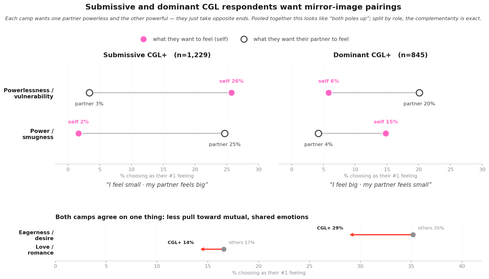

# Understanding Caregiving Dynamic Kinks

_Living document — survey witness (self-report). Twin of [`taxonomy/1b_CGL_Personals_Story_and_Report.md`](../taxonomy/1b_CGL_Personals_Story_and_Report.md) (behavioral witness). **v1.1 — 2026-06-21:** all comparisons standardized to CGL+ vs CGL−; figures + numbers re-anchored to source CSVs via [`build_story_figures.py`](build_story_figures.py). See Decision log._

CGL (Caregiving dynamics) is a **relational kink structured around one partner caring for another** within an explicitly-consented power-asymmetric frame—soft caregiving inside an unequal emotional dynamic.

> **Content note.** This piece discusses adult relationship preferences in plain, conversational terms. It is about consenting adults and the emotional and relational shapes their fantasies take.

---

## Goals & Data Source

**Research Goals:** Are there real, measurable differences between people who identify with or enjoy caregiving dynamics (CGL) and those who don't? And if so, what kind of differences are they?

**Data source:** The Big Kink Survey, created and administered by [Aella](https://aella.substack.com/p/heres-my-big-kink-survey-dataset). The survey collected responses from approximately 970,000 participants and covers sexual interests, personality traits, demographics, and relationship preferences. I analyzed a subset focused on caregiving dynamics:

- **15,503** respondents in the analyzed slice
- **2,845** who identify with caregiving dynamics (CGL-positive)
- **1,295** who don't (CGL-negative)
- **11,363** who did not answer the CGL item (Unknown — a missing-data category)

---

## How groups are defined, compared, and tested

**Operationalization.** Group membership comes from a single 0–5 self-rating, `cgl` ("how aroused are you by caregiving dynamics"):

| code | group | n | definition |
|:--|:--|--:|:--|
| `cgl ≥ 1` | **CGL+** | 2,845 | any endorsement of the caregiving-dynamic item |
| `cgl = 0` | **CGL−** | 1,295 | explicit non-endorsement |
| missing | **Unknown** | 11,363 | did not answer the CGL item |

**Comparator (read before any number).** Every comparison in this report is **CGL+ vs CGL−**. The **Unknown cohort is excluded** from all effect sizes — it is a missing-data category, not an opposing-preference group. This matters: on the kink-arousal block the Unknown cohort has **~100% non-response** (they were never routed to the CGL-gated items), so pooling them into a "Rest = CGL− + Unknown" comparator **inflates odds ratios** through differential, item-specific non-response. CGL+ and CGL− both answered the block at ~100%, so the CGL+ vs CGL− contrast carries no differential-non-response artifact. (Earlier drafts mixed a "vs Rest" comparator into the arousal figure; v1.1 removes it — see Decision log.)

**Varying N is expected, not an error.** The full cohort is 2,845 / 1,295, but each analysis uses only respondents who answered *that* item, so per-analysis n differs slightly (e.g., the D/S item: 2,777 / 1,267). Per-analysis n is stated in each chapter.

**Effect sizes over p-values.** At n ≈ 4,000 almost any non-zero difference is "significant," so every claim leads with a **sample-size-independent effect size** (Cohen's d for means, Cohen's h for proportions, rank-biserial r for ordinal ranks, odds ratio for binary endorsement) and treats the p-value as a gate, not evidence of magnitude.

**Multiple-comparison & CI policy.** The distribution/gap tables (Chapters 2, 4, 5, 6-endorsements) are **descriptive** — per-item effect sizes with no per-cell significance test, because the substantive question is *which items drive the difference*, not whether a 15-category table differs overall. The one place a formal family of tests is run — the 18-item **arousal scale** (Chapter 6) — carries **Benjamini-Hochberg FDR correction** and Wald 95% CIs on every odds ratio. CIs are reported where a test is run; gap tables are labeled descriptive.

---

## Findings

People often assume that a kink reveals who someone *is* — their personality, their hidden self, the truth underneath the surface. When analyzing those assumptions using data on the people who desire CGL dynamics against those who don't, that assumption falls apart.

> **TL;DR.** CGL isn't a personality type — it's a *way of relating*. CGL respondents lean (mildly) submissive, want emotionally asymmetric experiences with a caregiving structure, and pair high non-consent fantasy with high enthusiastic consent. The six highlights below trace this story from personality charateristics → emotional experiences → role & scene preferences → arousal signals.

### Myths vs. data

There are common stereotypes about CGL dynamics evaluated through data:

| The stereotype | What the data says | Where |
|:---|:---|:---|
| **CGL is a personality type — it tells you who someone "really" is**    **CGL respondents feel generally powerless or low-agency in life**    **Littles are immature, broken, or can't function as adults** | • The OCEAN Big Five personality test (openness, conscientiousness, extraversion, neuroticism, agreeableness) reveals **no meaningful difference** between CGL+ and CGL−     • Evaluating respondents' beleif on their locus of control shows **no difference either** — CGL respondents don't feel less in control of their lives.    • Not more agreeable, more open, more conscientious, or more neurotic   • No stereotyped personality or belief profile applies | H1 |
| **CGL = a dominant person controlling a submissive person**    **CGL = a submissive identity, full stop** | • CGL tilts submissive on average: **44% vs 38%** — only a 6% gap   • **~30%** of CGL respondents are dominant; another ~25% are switches or prefer equal partnerships   • A real lean, but so small it barely matters — far smaller than how much people differ from one another   • Knowing someone desires CGL barely tells you their D/S preference — it tilts the odds, it doesn't lock anyone in | H3 |
| **It's "wholesome soft kink" — nothing intense going on**   **It's not "real" BDSM — just cuddling** | **When comparing scene desires, there are key differences in someone who seeks CGL dynamics wants:**  • Gentleness **+14%**   • Consensual nonconsent fantasy **+13%**   • Power dynamics & D/s **+12%**   • Humiliation **+11.7%**   • Sadomasochism **+11.2%**    **Signals found at the arousal level indicate that structured power exchange are more desired:**   • Full-time power exchange **2.09×** more likely arousing   • Obedience **2.03×**   • Master/slave **1.86×**   • Mindbreak / mental domination **1.65×**   • Extreme bondage **1.64×**    Soft caregiving sits *inside* a power-asymmetric frame — both registers, not one or the other | H5, H6 |
| **It's about being attracted to older partners or age gaps** | • **Having an older partner**: no real difference — CGL respondents are no more drawn to it than anyone else   • **An age gap between partners**: nearly everyone asked finds it at least a little arousing, so a simple yes/no can't separate the groups — but CGL respondents find it *more strongly* arousing (46% vs 37% say "very/extremely"). A small difference, not nothing.    • The single biggest turn-on for CGL respondents is **being treated as small, soft, and cared-for** (regression): **2.76× more likely** to find it arousing   • Being cared-for matters far more than any age gap    • Bottom line: it's about the "cared-for" feeling, not partner age | H6 |

### Additional findings

- **CGL respondents want a complementary, lopsided pairing — one partner powerless, the other powerful — not a mutual, peer-to-peer one.** 
  - Which side they want depends on their role: submissive CGL respondents mostly want to feel powerless themselves (26%) and their partner powerful (25%); dominant CGL respondents want the mirror image (partner powerless 20%, self powerful 15%).
  - Pooled together both poles look raised — that's the two camps averaged, not one fixed direction.
  - What they share: less pull toward mutual states — eagerness or desire drops to 29% (vs 35%); love or romance to 14% (vs 17%).

- **The asymmetry shows up in role preference.** 
  - CGL seeking individuals endorsed all 21 surveyed roles,but caregiving related roles tower above the rest:
    - Caretaker/caretakee dynamics (**4× more)
    - Babysitter (+10.7%)
    - Teacher (+8.6%)
    - Doctor (+6.6%)

- **A striking pairing: high non-consent fantasy *and* high enthusiastic consent desires.** 
  - Non-consent fantasy (+13.4%) and enthusiastic consent (+5.3%) are *both* elevated for CGL respondents.
  - These aren't in tension — they're the architecture of the kink: an intense, fantasy-coded power dynamic inside a clearly-consented frame.

**The core finding:** The CGL kink is best understood as a relational emotional preference — soft caregiving inside a power-asymmetric frame, explicitly consented to between adults. It's not a personality type or specific sexual experience. It's a dynamic focused on a way of relating.

---

## Highlight 1 · Personality & Beliefs About Control

> **CGL endorsers don't show a different in personality traits, or beliefs about their control in life. It shows up in what kind of relationship they like.**

- **The differences are smaller than random noise.** Across all six measures, the biggest gap between the groups is tiny — far smaller than how much people differ from each other within the same group.
- **With 4,000+ respondents, even a meaningless difference can look "statistically significant."**
  - So "significant" here doesn't mean "important"
  - What matters is whether the difference is big enough to matter in real life — and it isn't

> **The myth this kills:** "CGL is a personality type" and "littles are immature or broken." Neither shows up.
> **The takeaway:** Personality doesn't predict CGL. The signal must live somewhere else — in how people relate, what they want to feel, what they're drawn to.

---

## Highlight 2 · The Emotional Dynamic People Want

> **CGL respondents want a *complementary* pairing — one partner powerless, the other powerful — not the mutual, shared feelings everyone else leans toward. Which side they take depends on whether they're the little or the caregiver.**

- **The asymmetry is real and large — and it mirrors by role.**
  - **Submissive** CGL respondents want to feel powerless themselves (26%) and their partner powerful (25%).
  - **Dominant** CGL respondents want the exact mirror: their partner powerless (20%), themselves powerful (15%).
- **This is why the raw averages looked confusing.** Lump the two camps together and *both* "powerless" and "powerful" rise for the partner — because you're averaging littles and caregivers, who sit at opposite ends of the *same* asymmetry. The constant isn't a direction; it's the unequal pairing.
- **What both camps share: less pull toward mutual, shared feelings** (and more pull toward charged ones).
  - Eagerness or desire: 29% vs 35%
  - Love or romance: 14% vs 17%
  - Wanting to feel humiliated: 3.5% vs 1.2% — about three times more common.

> **The takeaway:** CGL runs on a *complementary* emotional structure — one partner small and cared-for, the other powerful and protective. Who wants which role varies; the lopsided pairing is the constant. It's the opposite of a mutual, peer-to-peer dynamic.

---

## Highlight 3 · Dominance & Submission

> **CGL leans submissive on average (44% vs 38%), but ~30% of CGL respondents are dominant and another quarter are switches.**

- **CGL respondents are more likely to be submissive — but only by 6%.** 
  - **CGL:** 44% sub, 25% switch-equal, 30% dom
  - **Non-CGL:** 38% sub / 29% switch-equal / 34% dom.
- **Three in ten CGL respondents are dominant.** Even within CGL, "totally submissive" is not the norm.

- **The pattern is real but small.** The groups genuinely lean towards a submissive direction — but the difference is small compared to the variation within each group.

> **The myth this kills:**  Two opposite stereotypes: "CGL = dom controlling a sub" and "CGL = submissive identity, full stop." Both fall apart.  CGL is compatible with dominance, submission, and switches.  
> **The takeaway:** Knowing someone is CGL doesn't tell you much about their D/S preference. It tilts the odds slightly. It doesn't lock anyone in.

---

## Highlight 4 · The Roles People Want (Caregiving Takes the Lead)

> **Unsurprisingly, CGL identifying respondents signal a stronger preference towards a caretaking roleplay (e.g. Teacher/Student, Maids, Babysitter, Nurse/Doctor).**

- **CGL respondents want *every* kind of role more often than non-CGL respondents.** Across 21 different role categories, there isn't a single one where non-CGL respondents lead. CGL respondents just have broader role-fantasy interests overall.
- **Certain roleplay differences stand out:** 
  - Babysitter +10.7%
  - Maid +9.8%
  - Student +9.4%
  - Teacher +8.6%
  - Doctor +6.6%

- **This is the structural core.** The specific roleplay (maid, student, teacher) is flexible. The caregiving relationship is not.

> **The takeaway:** CGL isn't about a specific fantasy role or outfit. It's about a caregiving relationship structure where one person is being looked after.

---

## Highlight 5 · What "Emotional Sexual Experience" Really Means for CGL

- **Caretaker/caretakee dynamics is the standout.**
  - 20% (CGL) vs 5% (non-CGL) — a 15.5% gap.
- In highlight 2, the data indicated that feeling love or romantic emotions aren't as important. However, they still desire an emotional experience that entials affection, romance, cuddling.

- **Enthusiastic consent is elevated** (+5%), which is interesting because in highlight 6, CGL respondents *also* over-endorse consensual non-consent fantasy by +13%.
  - This highlights the respondents awareness on emphasizing safety measures in more intense sexual experiences.

---

## Highlight 6 · What CGL Respondents Want Sexually

This highlight has three pieces: which **acts** CGL respondents prefer, which **scenes** they prefer, and what they find **arousing**. The biggest signal lives in scenes and arousal — not in the mechanics of specific acts.

### 6a · Acts & positions

> **Vaginal fingering is universal; fingering mouths is 8.5 points higher for CGL. The act-level signal is real but small.**

- **Baseline acts are nearly universal.** Vaginal fingering, oral sex, standard intercourse: 70–85% in both groups, with almost no gap. 
- **The acts CGL respondents prefer most** (over not CGL respondents) **are face and control sex acts.**
  - Fingering mouths: +8.5%
  - Facefucking: +7.1%
  - Facesitting: +5.9%
  - Facials: +5.2%
  - Spanking: +5.6%

- **Positions show smaller differences (~2-4%).** 

> **The takeaway:** CGL respondents like face-focused and control-focused acts more, but most sexual acts are popular across all groups. The bigger story is at the *scene / roleplay* level (vs specific sexual acts/positions).

### 6b · Scenes (the real signal)

> **Gentleness and consensual non-consent fantasies are the two largest preference gaps for CGL respondents.
 This highlights the scene preference is soft but also intense, inside an asymmetric frame.**

- **The biggest gaps appear in *sexual scenes*, not in sexual acts.** 
  - Gentleness: +13.8%
  - Consensual non-consent (CNC) fantasy: +13.4%
  - Power dynamics & D/s: +11.9%
  - Humiliation: +11.7%
  - Sadomasochism: +11.2%

- **Less common preferences also show big CGL gaps.**
  - Mental alteration: +10.9%
  - Bodily secretions: +9.7%
  - Nonstandard objects: +9.8%

- **Gentleness and consenual-non-consent experienced together tell the whole story.**
  - These aren't contradictions.
    - Gentleness = the caring, nurturing register
    - Non-consent fantasy = the power-asymmetric frame the scene happens inside.
  - Together: *soft caregiving inside a power-unequal structure.* This is the preferred CGL scene.
- **Scene gaps (+11–14%) are much larger than act-level gaps (+5–8%).** If you want to understand CGL sexually, look at the kind of scene people want, not the mechanics of what they do.

> **The takeaway:** CGL respondents want scenes that are tender on the inside and asymmetric on the outside — gentleness wrapped in a power dynamic.

### 6c · Arousal (the clearest signal)

> **The strongest single CGL kink arousal signal is regression — being treated as small, soft, cared-for. 
 CGL respondents are 2.76× as likely to find this arousing, but this is agnostic of age differences.**

- **Regression is the dominant signal.** 2.76× as many CGL respondents find it arousing.
  - **Regression** = arousal to being treated as smaller, softer, more vulnerable.
  
- **Six more items reach the moderate tier for CGL respondents.** The thread is a desire for structured power asymmetry.
  - Full-time power exchange (2.09×)
  - Progression / age-play progression (1.69×)
  - Master/slave (1.86×)
  - Extreme bondage (1.64×)
  - Mindbreak / mental domination (1.65×)
  - Worshipping (1.75×)

- **Five more items show weaker but FDR-significant arousal differences.**
  - Obedience (2.03×), voyeurism (other 1.50× / self 1.38×), medium bondage (1.72×), exhibitionism-other (1.44×) — all trend CGL.
- **Three things show no real difference.**
  - Having an older partner: no difference — whether you ask it as a simple yes/no or by how strongly people are turned on, CGL respondents are no different here.
  - Light bondage: no difference.
  - Humiliation (asked as a plain "is this arousing? yes/no"): no difference
    - It shows up strongly on the *preference* question, just not here — almost everyone in a kink survey finds humiliation at least a little arousing, so a yes/no question can't tell the groups apart. The signal is real; this one question just can't see it.
- **Age gap looks like "no difference" — but it isn't.**
  - Asked as a simple yes/no ("is an age gap at all arousing?"), there's no difference: about **97% of everyone who was asked** says yes, in both groups. When almost everyone says yes, a yes/no question can't separate them.
  - But ask *how strongly*, and a real gap appears: **46% of CGL respondents find it "very" or "extremely" arousing, vs 37%** of others. A small but real difference the yes/no question hides.
  - So age gap is a *small* part of the CGL picture — and far smaller than being cared-for, which is the real driver.

> **The myth this kills:** 
 1) "CGL is just cuddling, not real BDSM" — master/slave, full-time power, and extreme bondage all show strong arousal differences.
  2) "CGL is mainly about partner age" — having an *older partner* makes no difference at all; an *age gap* is only a small signal, far outweighed by being treated as small and cared-for (about twice the effect).
   **The takeaway:** CGL respondents are aroused most by being cared-for and by structured power imbalance. Partner age is a minor note: the "older partner" stereotype doesn't hold, and age gap matters far less than the cared-for direction.

### 6d · The cross-cutting pairing

> **Non-consent fantasy (+13.4%) and enthusiastic consent (+5.3%) are *both* higher for CGL respondents. These aren't in tension — they're the architecture of the kink.**

An intense, fantasy-coded power dynamic inside an explicitly-consented frame. The non-consent is fictional; the consent is real. CGL respondents value both at higher rates than non-CGL respondents, which is exactly what you'd expect from a kink that runs heavy emotional content through an explicit-negotiation frame.

---

 
 

# Technical Appendix — Methods, Effect Sizes, and Limits

> The remainder of this document is a structured technical report intended for analytical readers (data scientists, methodologists, researchers, peer reviewers). Each chapter follows the same template:
>
> 1. **Insight & relevance** — one-paragraph TL;DR, lead with effect size and verdict, not p-value.
> 2. **Headline numbers** — the table behind the claim.
> 3. **Method** — variables, test, rationale.
> 4. **Full statistics** — exact statistics, effect sizes, p-values.
> 5. **Interpretation and limits** — what the result does and does not license.

---

## Chapter 1 — Personality structure (OCEAN) and powerlessness (locus of belief) both fail to differentiate CGL identification

### Insight & relevance

**Insight.** Two conceptually distinct individual-differences constructs are tested:
1. **OCEAN** — the standard Big-Five *personality* model (openness, conscientiousness, extraversion, neuroticism, agreeableness).
2. **Powerlessness** — **not** a personality trait, but a *locus-of-belief* measure in the tradition of Rotter's locus-of-control. It captures the degree to which a respondent believes outcomes happen *to* them vs. *because of* them.

Across all six measures, every Cohen's d between CGL-positive (n=2,845) and CGL-negative (n=1,295) respondents falls inside the trivial-effect band (|d| < 0.10). The largest absolute d is 0.044 (extraversion). Powerlessness, the construct most plausibly related to CGL on prior intuition, is d = +0.04 — also trivial. With this sample size, statistical "significance" is essentially guaranteed for any non-zero difference, which is why effect size — not p-value — is the relevant decision metric.

**Relevance.** This is a *dual* clean null result. The OCEAN null rules out a personality-based account of CGL; the powerlessness null rules out the simplest alternative ("CGL respondents feel less agentic in general"). Both are strong priors against the framing that CGL "is who someone is" or "reflects how they feel about control in their life." Together they motivate the rest of the report's focus on **relational structure**, **emotion**, and **content preference** — variables that describe how someone *relates and arouses*, not who they *are*.

### Headline numbers

| trait             |   mean_cgl |   mean_non |   diff |     d | magnitude   |   n_cgl |   n_non |
|:------------------|-----------:|-----------:|-------:|------:|:------------|--------:|--------:|
| openness          |       1.69 |       1.70 |  -0.01 | -0.01 | trivial     |    2845 |    1295 |
| conscientiousness |       1.20 |       1.25 |  -0.05 | -0.02 | trivial     |    2845 |    1295 |
| extroversion      |      -1.30 |      -1.17 |  -0.13 | -0.04 | trivial     |    2845 |    1295 |
| neuroticism       |       1.02 |       1.03 |  -0.01 | -0.01 | trivial     |    2845 |    1295 |
| agreeableness     |       1.94 |       1.83 |   0.11 |  0.04 | trivial     |    2845 |    1295 |
| powerlessness     |       0.96 |       0.81 |   0.15 |  0.04 | trivial     |    2845 |    1295 |

By the standard convention, `|d| < 0.10` is "trivial," `0.10–0.20` is "very small," `0.20–0.50` is "small," and `0.50+` is medium-to-large. All values in this table are in the trivial band.

### Method

- **OCEAN variables.** Five trait scores (`opennessvariable`, `consciensiousnessvariable`, `extroversionvariable`, `neuroticismvariable`, `agreeablenessvariable`). Each is computed as a positively-worded item minus an oppositely-worded item (range −6 to +6), which controls for acquiescence bias.
- **Powerlessness variable.** `powerlessnessvariable`, a three-item sum (range −9 to +9). **This is a locus-of-belief measure, not a Big-Five personality trait**; it is included alongside OCEAN because both are *individual-differences* candidates for distinguishing CGL identification, but it should not be reported as a "sixth OCEAN trait."
- **Test.** Independent-sample comparison of means between CGL=True (n=2,845) and CGL=False (n=1,295), summarised as Cohen's d on the pooled standard deviation.
- **Why Cohen's d, not a p-value.** With n > 4,000, any non-zero population difference produces statistical significance regardless of substantive importance. d standardises by pooled SD and is sample-size-independent, which is the appropriate basis for deciding whether a result is *practically* meaningful.

### Interpretation and limits

- A null result against OCEAN does not rule out differences on narrower facets (e.g., specific subfacets of agreeableness such as compassion or tender-mindedness).
- The powerlessness null is about *generalised* belief in agency, not scene-specific or partner-specific powerlessness (which Chapters 2–5 examine and which *do* differentiate CGL).
- Both findings are about *trait-like* individual differences, not state. They do not speak to mood, situational disposition, or context-specific behaviour.
- The dual null reframes downstream analysis: any genuine signal in the CGL data must come from variables describing *relationship*, *emotion*, or *content preference*, not from variables describing *who someone is* or *how they generally believe outcomes work*.

---

## Chapter 2 — Emotional desires: bidirectional asymmetry, not lower intensity

### Insight & relevance

**Insight.** On the two paired emotion-preference items (`youfeelmost`: what I want to feel; `otherfeel1most`: what I want to evoke), CGL-positive respondents shift toward power-asymmetric emotions and away from mutual-pursuit emotions. The largest positive gaps on "what I want to feel" are powerlessness/vulnerability (+3.9 points), humiliation/worthlessness (+2.3), safety/warmth (+1.1), and power/smugness (+0.9); the largest negative gaps are eagerness/desire (−6.4) and love/romance (−2.5). The complementary panel ("what I want to evoke") shows the inverse-role pattern: CGL respondents want partners to feel powerlessness/vulnerability or power/smugness.

**Relevance.** This is the emotional-grammar half of the structural story. Chapter 4 establishes the caregiving structure; this chapter shows the emotional content of that structure is *bidirectionally asymmetric* — two parties seeking different and complementary emotional positions, not "both parties feeling soft together." This is the clearest correction to the "CGL is wholesome / soft kink" framing in the public discourse.

> ⚠ **The pooled `otherfeel1most` panel is a mixture, not a paradox.** CGL+ over-endorse *both* partner-powerlessness (+2.2) and partner-power (+1.4) because the group blends ~44% submissive and ~30% dominant respondents, who want mirror-image pairings. Conditioning on D/S preference (table below, and Highlight 2's figure) resolves it: submissives want self-powerless / partner-powerful; dominants want the exact reverse. The aggregate gap column **understates** the asymmetry — read it together with the role split, not on its own.

### Headline numbers — `youfeelmost` (categories > 2% in any group)

Sorted by gap (CGL-True minus CGL-False).

| youfeelmost                    |   False |   True |   Unknown |   Δ (T−F) |
|:-------------------------------|--------:|-------:|----------:|----------:|
| Powerlessness or vulnerability |   11.40 |  15.30 |     10.70 |      3.90 |
| Humiliation or worthlessness   |    1.20 |   3.50 |      1.90 |      2.30 |
| Safety or warmth               |    4.70 |   5.80 |      6.90 |      1.10 |
| Power or smugness              |    5.40 |   6.30 |      4.40 |      0.90 |
| Shyness or nervousness         |    2.30 |   2.60 |      1.90 |      0.30 |
| Wildness or primalness         |   15.70 |  15.30 |     11.30 |     -0.40 |
| Love or romance                |   16.60 |  14.10 |     22.00 |     -2.50 |
| Eagerness or desire            |   35.20 |  28.80 |     34.10 |     -6.40 |

### `otherfeel1most` — emotion respondents most want to evoke in their partner

| otherfeel1most                 |   False |   True |   Unknown |   Δ (T−F) |
|:-------------------------------|--------:|-------:|----------:|----------:|
| Powerlessness or vulnerability |    8.10 |  10.30 |      6.70 |      2.20 |
| Power or smugness              |   12.80 |  14.20 |     11.20 |      1.40 |
| Humiliation or worthlessness   |    1.20 |   2.00 |      1.30 |      0.80 |
| Cruelty or brutality           |    1.40 |   2.00 |      1.10 |      0.60 |
| Safety or warmth               |    5.00 |   5.30 |      6.70 |      0.30 |
| Shyness or nervousness         |    3.50 |   3.70 |      3.20 |      0.20 |
| Anger or tension               |    2.50 |   2.40 |      1.40 |     -0.10 |
| Wildness or primalness         |   14.30 |  13.60 |     11.40 |     -0.70 |
| Love or romance                |   14.00 |  12.40 |     19.10 |     -1.60 |
| Eagerness or desire            |   30.50 |  26.80 |     32.70 |     -3.70 |

### Emotion preference by D/S role (CGL+ only) — the mirror behind the aggregate

Splitting CGL-positive respondents by D/S preference exposes the complementarity the pooled columns hide. Each cell is the % choosing that emotion as their **top** pick (among responders to the item).

| CGL+ subgroup        |   self: powerless |   self: power |   partner: powerless |   partner: power |
|:---------------------|------------------:|--------------:|---------------------:|-----------------:|
| Submissive (n=1,229) |              25.7 |           1.6 |                  3.4 |             24.7 |
| Switch/equal (n=703) |               8.3 |           4.3 |                 10.1 |              7.6 |
| Dominant (n=845)     |               5.8 |          14.8 |                 20.1 |              4.2 |

_Cells are % among responders to each emotion item, so subgroup n's are the emotion-item responders within each D/S camp (sum ≈ the 2,777 who answered the D/S item)._

The submissive and dominant rows are near-perfect mirror images: each camp wants one party powerless and the other powerful, in opposite directions (submissive: self-powerless 25.7 / partner-powerful 24.7; dominant: partner-powerless 20.1 / self-powerful 14.8). The switch/equal middle is roughly balanced. This is the mechanism behind the "bidirectional asymmetry" framing and Highlight 2's mirror figure, and it is consistent with Chapter 3 — CGL+ contains substantial dominant and switch minorities, not only submissives. Pooling the three rows partially cancels the opposing directions, which is why the aggregate `otherfeel1most` gaps look small and bidirectional.

### Method

- **Variables.** `youfeelmost` and `otherfeel1most`, both single-answer categorical with ~15 emotion labels each.
- **Reporting.** Within-group percentage distribution, with the per-category gap (CGL-True − CGL-False) as the comparison metric. Categories with < 2% in every group are dropped from display (long tail of rarely-chosen emotions); they remain in the underlying data.
- **Why not chi-square.** A 15-category × 3-group chi-square at n ~ 15,000 is essentially guaranteed to reject the null. The substantive question is *which categories drive the difference*, which the gap column makes explicit.

### Interpretation and limits

- The pattern is **bidirectional asymmetry, not lower intensity.** CGL respondents are not less emotionally engaged than non-CGL respondents — they shift their emotional preferences toward roles in a hierarchical scene rather than toward peer-equal mutual states.
- The humiliation/worthlessness gap (+2.3 pts) is meaningful here *as a single most-preferred emotion*, but the binary arousal-endorsement test in Chapter 5 shows humiliation is **not** CGL-distinguishing at the "is this arousing at all" level. These two facts are consistent: humiliation is widely endorsed across kink-survey respondents, but CGL respondents are more likely to rank it as their top emotion when forced to pick.
- Single-answer categorical: each respondent contributes to exactly one row; gaps are not independent across rows. Substantive interpretation should focus on the largest gaps rather than on every cell.
- The Unknown column on these items behaves more like CGL=False than CGL=True (modal "eagerness or desire," low humiliation), consistent with much of the Unknown cohort being non-CGL respondents who simply did not complete the CGL-identification item.

---

## Chapter 3 — Dominance / Submission preference: significant but magnitudinally small

### Insight & relevance

**Insight.** On a 7-point dominance-submission scale, CGL-positive respondents skew submissive (44.3%) more than CGL-negative respondents (37.8%) — a real and statistically significant difference (Mann-Whitney U, p = 7×10⁻⁵), but with a negligible effect size (rank-biserial r = +0.077). Approximately 30% of CGL+ respondents identify as dominant; another 25% sit in the switch/equal middle. The substantively important relational signal is not the D/S tilt itself; it is the caretaker/caretakee over-representation (Chapter 4) that the D/S tilt sits on top of.

**Relevance.** This chapter is the most important sanity check against the "CGL = submissive identity" framing in the discourse. The data licenses "tilts submissive on average" and does not license "is submissive." The tilt is reproducible (Mann-Whitney U on the ordinal rank, p < 0.001), but the magnitude is small relative to within-group variance.

### Headline numbers — D/S spectrum, collapsed to three buckets

CGL+ vs CGL− among respondents to the D/S item (Unknown excluded as missing-data).

| group   |        n |   Submissive % |   Switch/Equal % |   Dominant % |
|:--------|---------:|---------------:|-----------------:|-------------:|
| CGL−    |  1,267   |          37.8  |            28.7  |        33.5  |
| CGL+    |  2,777   |          44.3  |            25.3  |        30.4  |

### Method

- **D/S variable.** `ds_preference`, a 7-point ordinal scale from "Totally submissive" to "Totally dominant," mapped to integer rank 1–7.
- **Test.** Mann-Whitney U on the ordinal rank, CGL+ vs CGL− (two groups; Unknown excluded as a missing-data category per the report-wide comparator policy).
- **Rationale for non-parametric testing.** `ds_preference` is ordinal — the interval between "Slightly submissive" and "Moderately submissive" is not guaranteed equal to other gaps on the scale. Rank-based tests respect ordinality without assuming normal residuals or equal variance.
- **Effect size.** Rank-biserial r (derived from U), sample-size-independent and the appropriate companion to the p-value here.

### Full statistics

- **Mann-Whitney U on D/S rank (CGL+ vs CGL−):** U = 1,624,603, p = 7×10⁻⁵ (***), rank-biserial r = +0.077 (negligible), n = 2,777 (CGL+) + 1,267 (CGL−).
- Rank-biserial bands: |r| < 0.10 negligible, 0.10–0.30 small, 0.30–0.50 moderate. The observed r = 0.077 is below the negligible threshold — a real but practically trivial submissive tilt.

### Interpretation and limits

- The D/S result is *directionally informative but practically small*. Reporting it without an effect size would inflate its substantive weight.
- A "switch" who plays caregiver in one scene and little in another is fully consistent with the data. Treating the submissive lean as a binary identity is wrong.

---

## Chapter 4 — Role desires: caregiving structure as the categorical signature

### Insight & relevance

**Insight.** Among 21 surveyed role-fantasy categories, CGL-positive respondents endorse every single one at a higher rate than CGL-negative respondents (no role is non-CGL-tilted). The largest gaps cluster on roles with a caregiving or guidance shape (babysitter +10.7pp, teacher +8.6pp, doctor +6.6pp). The categorically defining signal, however, is on a separate soft-erotic item: the **caretaker/caretakee dynamic**, endorsed at 20% by CGL+ vs 5% by CGL− — a more-than-fourfold over-representation and the largest single soft-erotic gap in the dataset.

**Relevance.** This is the chapter that locates CGL within the kink taxonomy. The role-uniformity finding implies CGL identification is *additive* — it sits on top of generally broader role-fantasy engagement, not in opposition to it. The caretaker-dynamic gap identifies CGL specifically as a kink organised around caregiving structure, with role-fantasy breadth as an associated but not category-defining property.

### Headline numbers — top 10 role gaps (CGL-True − CGL-False)

|              |   False |   True |   Unknown |   gap_T_minus_F |
|:-------------|--------:|-------:|----------:|----------------:|
| Babysitter   |   24.60 |  35.30 |     13.80 |           10.70 |
| Catgirls     |   14.00 |  24.40 |     12.10 |           10.40 |
| Maids        |   26.70 |  36.50 |     20.30 |            9.80 |
| Students     |   27.90 |  37.30 |     16.30 |            9.40 |
| Teachers     |   36.80 |  45.40 |     22.60 |            8.60 |
| Strippers    |   21.40 |  28.70 |     14.20 |            7.30 |
| Cheerleaders |   22.40 |  29.60 |     16.10 |            7.20 |
| Criminals    |   13.40 |  20.20 |      7.30 |            6.80 |
| Doctors      |   24.20 |  30.80 |     14.90 |            6.60 |
| Celebrities  |   15.80 |  22.30 |      8.20 |            6.50 |

### Caretaker / caretakee dynamic — the structural signature

**20.2% of CGL-positive respondents endorse the caretaker/caretakee dynamic, vs. 4.6% of CGL-negative respondents.** Cohen's h on this single item is 0.498 (the small-to-medium / medium boundary — see Chapter 5), and the absolute percentage-point gap (+15.5) is the largest in the soft-erotic preference set.

### Method

- **Role variables.** 21 binary `role_*` columns. Endorsement rate per CGL group computed as `mean(role_x == 1)` within each group.
- **Caretaker variable.** `soft_erotic_caretaker/caretakee dynamics`, a separate binary item in the soft-erotic preference block.
- **Reporting.** Percentage-point gap (CGL-True − CGL-False) per item; uniformity of sign across all 21 role items is itself a substantive finding and not a per-item test result.

### Interpretation and limits

- The uniform-positive sign across all 21 roles is consistent with CGL respondents indexing higher on a latent "openness to role-based fantasy" construct (this is the basis of Chapter 5's *original* variety-vs-roles analysis in the source findings doc — see [`1a_CGL_EDA_Findings.md`](1a_CGL_EDA_Findings.md) for the Spearman ρ = 0.149 result on `n_roles` vs `variety_num`).
- The caretaker-dynamic gap is the load-bearing finding of this chapter and the strongest single soft-erotic signal in the survey. Treating it as a categorical signature (rather than a small additional preference) is supported by the magnitude.
- Causal direction is not identified: role-fantasy openness and CGL identification could share an upstream cause, or one could drive the other. Observational data does not distinguish.

---

## Chapter 5 — Soft-erotic preferences: the caregiving signal at the preference level

### Insight & relevance

**Insight.** Across ten soft-erotic preference items, **caretaker / caretakee dynamics** is the only item to reach the medium-effect threshold: CGL+ 20.2% vs CGL− 4.6%, Δ = +15.5pp, Cohen's h ≈ **0.498** (a 4.4× lift). Every other soft-erotic item is endorsed at a higher rate by CGL+ than CGL− (uniform positive direction), but at small effect magnitudes (h ≈ 0.06–0.19): affection (+6.4pp, h=0.144), sensual healing (+6.3pp, h=0.186), romance (+6.1pp, h=0.136), cuddling (+5.8pp, h=0.129), enthusiastic consent (+5.3pp, h=0.122), therapeutic sexual experiences (+5.0pp, h=0.141), energy work (+3.2pp, h=0.132), tantra (+1.4pp, h=0.063).

**Relevance.** This chapter resolves what looks at first like an ambiguity in the data: are CGL respondents "into soft stuff broadly" or "into one specific structural item"? The answer is **both, but only one matters categorically**. CGL respondents endorse a broader caring/tender package on average — but the *category-defining* signal lives entirely in the caretaker/caretakee item. That item is also the cleanest mechanistic link to Chapter 4 (caregiving-shaped role-fantasy) and Chapter 2 (asymmetric-emotion picture). Treating "CGL is soft kink" as the headline is empirically misleading; treating "CGL is built around a caretaker/caretakee dynamic" is empirically supported.

### Headline numbers — soft-erotic preferences (CGL+ vs CGL−)

n CGL+ = 2,845; n CGL− = 1,295. Sorted by |Δ|.

| preference                       | CGL+ % | CGL− % | Δ (pp)   | Cohen's h | effect tier |
|:---------------------------------|-------:|-------:|---------:|----------:|:------------|
| **caretaker / caretakee dynamics** | 20.18  | 4.63   | **+15.54** | **0.498** | small–med (≈0.50 boundary) |
| affection                        | 31.39  | 24.94  | +6.45    | 0.144     | small       |
| sensual healing                  | 16.66  | 10.35  | +6.31    | 0.186     | small       |
| romance                          | 31.14  | 25.02  | +6.12    | 0.136     | small       |
| cuddling                         | 30.97  | 25.17  | +5.79    | 0.129     | small       |
| enthusiastic consent             | 27.35  | 22.08  | +5.26    | 0.122     | small       |
| therapeutic sexual experiences   | 17.19  | 12.20  | +4.99    | 0.141     | small       |
| energy work                      | 7.80   | 4.63   | +3.17    | 0.132     | small       |
| tantra                           | 5.69   | 4.32   | +1.37    | 0.063     | trivial     |

### Method

- **Variables.** Ten binary `soft_erotic_*` columns in `cgl_BKS_data.csv`.
- **Comparison.** CGL+ (cgl_flag == True, n=2,845) vs CGL− (cgl_flag == False, n=1,295). The Unknown cohort is plotted separately in the figure but excluded from the headline comparison because it is a missing-data category, not an opposing-preference group.
- **Endorsement metric.** Per-item percentage endorsing (sum / group size).
- **Effect size.** Cohen's h, base-rate-normalised: `h = 2·arcsin(√p1) − 2·arcsin(√p2)`. Conventional bands: |h| < 0.10 trivial, 0.10–0.20 small, 0.20–0.50 small-to-medium, 0.50+ medium-to-large. `caretaker/caretakee` sits right at the small-to-medium / medium boundary (h = 0.498 ≈ 0.50); every other item sits in the small band.

### Interpretation and limits

- The caretaker-item gap (h ≈ 0.498) is the largest single soft-erotic signal in the survey and the **mechanistic bridge** between Chapter 4's caregiving-role finding and Chapter 6's NSFW common-preference findings. Lead with this item when describing "what CGL is at the preference level."
- The remaining soft-erotic items all shift positively at small magnitudes — consistent with CGL respondents having a slightly elevated tenderness register on average, but **not** consistent with "CGL is broadly soft kink" as a categorical claim. That stronger reading is not licensed by these effect sizes.
- `enthusiastic consent` and `clear` are duplicated in the source data; reported once here to avoid implying independent signal.
- Construct validity: "soft erotic preferences" is a survey-author label, not a psychometrically-validated construct. Findings hold descriptively at the item level; no claim is made about a latent "soft" factor.

---

## Chapter 6 — NSFW preferences and arousal-scale items: where the content signal lives

### Insight & relevance

**Insight (endorsements — common + uncommon block).** Across the NSFW endorsement blocks, the largest CGL+ vs CGL− gaps live in the common-preferences block: **gentleness** (+13.8pp, h = 0.280), **nonconsent fantasy** (+13.4pp, h = 0.271), **power dynamics & D/s** (+11.9pp, h = 0.252), **humiliation** (+11.7pp, h = 0.253), **sadomasochism** (+11.2pp, h = 0.227), and **roles** (+9.7pp, h = 0.197). Top uncommon-preference items (mental alteration +10.9pp, objects nonstandard +9.8pp, bodily secretions +9.7pp, reproduction +9.4pp) sit in the same small-to-moderate magnitude range. Effect sizes are *not* medium-effect — the largest is h ≈ 0.28 — but the consistency of direction across structurally-related items (gentleness AND nonconsent AND power dynamics AND humiliation) is itself the substantive signal.

**Insight (endorsements — acts + positions block).** Sexual-act gaps are smaller and concentrated on a coherent face/mouth/control-flavoured subset: fingering mouths (+8.5pp, h = 0.169), facefucking (+7.1pp, h = 0.151), fisting (+6.0pp, h = 0.154), facesitting (+5.9pp, h = 0.121), spanking (+5.6pp, h = 0.121), facials (+5.2pp, h = 0.106). Positions are even smaller (top items at h < 0.10). Universally-popular acts (vaginal fingering, oral, standard intercourse) show negligible CGL-vs-CGL− gaps. The CGL signal at the act level is not "are you into sex" — it is "which thin subset of acts carry a power-dynamic flavour."

**Insight (arousal scale).** Across 18 power-dynamic, bondage, voyeurism, and age-related arousal items (0–5 scale, binarised at ≥ 1, CGL+ vs CGL−), **regression** is the single strongest CGL signal: OR = 2.76× (95% CI [2.41, 3.18]), Cohen's h = +0.50, FDR-adjusted p < 0.001. **Seven items** reach the moderate-effect tier (|h| ≥ 0.20 with significant FDR-adjusted p): regression, fulltimepower, progression, masterslave, extremebondage, mindbreak, worshipping. **Six items fail FDR-corrected significance** on the binary test: humiliation, exhibitionself, worshipped, older, lightbondage, agegap. **Two of these six are ceiling artifacts of the ≥1 binarisation, not true nulls:** humiliation (near-universal endorsement, 97% vs 95% — note this differs from the common_humiliation endorsement, which *is* significant) and **agegap** — which shows a 97% ceiling on the binary but a small real difference on the full 0–5 scale (CGL+ mean 3.21 vs CGL− 2.94, Cohen's d = 0.21, Mann-Whitney p ≈ 2×10⁻¹⁰). `older` and `lightbondage` are true nulls (older d = 0.055 on intensity). _(These ORs are CGL+ vs CGL−; an earlier draft compared CGL+ vs a "Rest" pool that the non-responding Unknown cohort inflated — see Decision log.)_

**Relevance.** This chapter is the most defensible empirical statement of "what CGL content preference actually looks like." It locates the strongest endorsement signal in the **common-preferences block** (scene framing, not specific acts), the strongest single-item arousal signal in **regression** (consistent with the caring-direction story), and confirms that partner-age items (older, agegap) are **not** CGL-distinguishing once multiple comparisons are corrected for. It also clarifies the humiliation-measurement difference: significant on the common-prefs endorsement test, null on the binary arousal-scale test, for measurement-specific reasons (ceiling effect at ≥1 on the arousal scale).

### Headline numbers — NSFW endorsement gaps (CGL+ vs CGL−)

n CGL+ = 2,845; n CGL− = 1,295. Sorted by |Δ| within each block.

#### Acts + positions (top 10)

| family    | item                              | CGL+ % | CGL− % | Δ (pp) | Cohen's h | effect tier |
|:----------|:----------------------------------|-------:|-------:|-------:|----------:|:------------|
| acts      | fingering mouths                  | 52.9   | 44.5   | +8.5   | 0.169     | small       |
| acts      | facefucking                       | 69.9   | 62.8   | +7.1   | 0.151     | small       |
| acts      | fisting (vaginas)                 | 21.8   | 15.8   | +6.0   | 0.154     | small       |
| acts      | facesitting                       | 61.5   | 55.6   | +5.9   | 0.121     | small       |
| acts      | spanking                          | 72.3   | 66.7   | +5.6   | 0.121     | small       |
| acts      | facials                           | 58.9   | 53.7   | +5.2   | 0.106     | small       |
| positions | spooning                          | 57.6   | 52.7   | +5.0   | 0.100     | small       |
| positions | reverse cowgirl                   | 54.5   | 49.6   | +4.9   | 0.099     | trivial-sm  |
| acts      | pegging                           | 27.6   | 22.7   | +4.9   | 0.113     | small       |
| acts      | squirting                         | 62.5   | 57.9   | +4.6   | 0.094     | trivial-sm  |

#### Common + uncommon preferences (top 10)

| family    | item                              | CGL+ % | CGL− % | Δ (pp) | Cohen's h | effect tier |
|:----------|:----------------------------------|-------:|-------:|-------:|----------:|:------------|
| common    | **gentleness**                    | 64.3   | 50.5   | +13.8  | **0.280** | small–med   |
| common    | **nonconsent**                    | 61.6   | 48.2   | +13.4  | **0.271** | small–med   |
| common    | **power dynamics & D/s**          | 71.9   | 60.0   | +11.9  | **0.252** | small–med   |
| common    | **humiliation**                   | 37.2   | 25.5   | +11.7  | **0.253** | small–med   |
| common    | sadomasochism                     | 46.9   | 35.8   | +11.2  | 0.227     | small–med   |
| uncommon  | mental alteration                 | 34.1   | 23.2   | +10.9  | 0.244     | small–med   |
| uncommon  | objects: nonstandard              | 34.0   | 24.2   | +9.8   | 0.217     | small–med   |
| uncommon  | bodily secretions                 | 33.6   | 23.9   | +9.7   | 0.216     | small–med   |
| common    | roles                             | 61.5   | 51.8   | +9.7   | 0.197     | small       |
| uncommon  | reproduction                      | 36.6   | 27.3   | +9.4   | 0.201     | small–med   |

The **gentleness + nonconsent + power dynamics + humiliation** cluster at the top of the common-preferences block is the substantive content-level signal: CGL respondents over-endorse the *soft register* and the *structured-asymmetry register* together, not one in opposition to the other. The pairing is the two halves of a CGL scene — caring inside an asymmetric frame — showing up at the kink-preference level.

### Headline numbers — arousal-scale binary endorsement test

Sorted by effect size. **OR** is the odds ratio of CGL+ vs **CGL−** endorsing the item (≥ 1 on 0–5), with Wald 95% CI. **p_fdr** is Benjamini-Hochberg-corrected across the 18 items. **Tier is set by Cohen's h** (one consistent metric, base-rate-normalised), gated on FDR significance + a CI excluding 1: moderate |h| ≥ 0.20, weak 0.10 ≤ |h| < 0.20, no effect = fails FDR (no item reaches the |h| ≥ 0.50 "strong" band). OR is shown as support, not as the tier driver — using OR to tier produced the inconsistency where two items with the same h landed in different tiers.

| variable        |   OR  |  OR 95% CI       |  Cohen's h |  p_fdr     | tier            |
|:----------------|------:|:-----------------|-----------:|:-----------|:----------------|
| regression      | 2.76  | [2.41, 3.18]     |     +0.50  | < 0.001    | Moderate        |
| fulltimepower   | 2.09  | [1.74, 2.52]     |     +0.32  | < 0.001    | Moderate        |
| progression     | 1.69  | [1.48, 1.94]     |     +0.26  | < 0.001    | Moderate        |
| masterslave     | 1.86  | [1.49, 2.33]     |     +0.22  | < 0.001    | Moderate        |
| extremebondage  | 1.64  | [1.34, 2.00]     |     +0.20  | < 0.001    | Moderate        |
| mindbreak       | 1.65  | [1.35, 2.01]     |     +0.20  | < 0.001    | Moderate        |
| worshipping     | 1.75  | [1.43, 2.15]     |     +0.20  | < 0.001    | Moderate        |
| obedience       | 2.03  | [1.50, 2.73]     |     +0.19  | < 0.001    | Weak            |
| voyeurother     | 1.50  | [1.20, 1.88]     |     +0.16  | < 0.001    | Weak            |
| humiliation     | 1.85  | [1.02, 3.34]     |     +0.12  | 0.080      | **No effect** † |
| voyeurself      | 1.38  | [1.10, 1.73]     |     +0.12  | 0.013      | Weak            |
| mediumbondage   | 1.72  | [1.15, 2.58]     |     +0.11  | 0.018      | Weak            |
| exhibitionother | 1.44  | [1.07, 1.93]     |     +0.11  | 0.026      | Weak            |
| exhibitionself  | 1.31  | [0.97, 1.77]     |     +0.08  | 0.112      | **No effect**   |
| worshipped      | 1.27  | [0.97, 1.65]     |     +0.07  | 0.112      | **No effect**   |
| **older**       | 1.11  | [0.98, 1.27]     |     +0.05  | 0.128      | **No effect**   |
| **lightbondage**| 1.29  | [0.76, 2.17]     |     +0.04  | 0.441      | **No effect**   |
| **agegap**      | 1.15  | [0.77, 1.71]     |     +0.02  | 0.564      | **No effect** † |

After switching from the contaminated "vs Rest" comparator to CGL+ vs CGL−, the headline (**regression OR 2.76**, CI [2.41, 3.18]) is **unchanged** — both groups answered the block fully, so it never depended on the comparator. Several power-exchange ORs that were inflated by the Unknown cohort's differential non-response shrink toward their true value (e.g. `masterslave` 2.39→1.86, `voyeurother` 2.27→1.50, `mindbreak` 2.02→1.65), and two items (`exhibitionself`, `worshipped`) drop below FDR significance. **Seven items** reach the moderate tier (regression, fulltimepower, progression, masterslave, extremebondage, mindbreak, worshipping); **six fail FDR** (humiliation, exhibitionself, worshipped, older, lightbondage, agegap). No item reaches the "strong" (|h| ≥ 0.50) band — regression, at h = 0.498, sits just under it.

> ⚠ **Two of the six "No effect" rows are ceiling artifacts of the ≥1 binarisation (†), not true nulls.** **`agegap`**: 97% of *both* CGL+ and CGL− clear the ≥1 threshold, so the binary test has no power — but on the full 0–5 scale CGL+ rate it higher (mean **3.21 vs 2.94**; **46% vs 37%** "very/extremely"; Cohen's **d = 0.21**; Mann-Whitney **p ≈ 2×10⁻¹⁰**). It is a *small* real signal, not a null. **`humiliation`**: same ceiling (97% vs 95%) — significant on the common-prefs endorsement (+11.7pp, h = 0.253), null here; the binary OR 1.85 is unstable (CI [1.02, 3.34]) precisely because almost everyone clears the floor. **`older`** is a true null on the 0–5 intensity scale too (d = 0.055, p = 0.087); **`lightbondage`** is a true null (98% vs 97% ceiling).

### Method

- **Endorsement variables.** Binary `act_*`, `pos_*`, `common_*`, `uncommon_*` columns in `BKS_nsfw_preferences.csv`.
- **Endorsement comparison.** CGL+ (`cgl_flag == True`, n=2,845) vs CGL− (`cgl_flag == False`, n=1,295). The Unknown cohort is excluded from every comparison and is not plotted, because it is a missing-data category, not an opposing-preference group.
- **Endorsement metric.** Per-item percentage endorsing (sum / group size). Effect size = Cohen's h (base-rate-normalised) computed as `2·arcsin(√p1) − 2·arcsin(√p2)`.
- **Arousal-scale variables.** 18 items rated 0–5 (0 = "not arousing at all"), binarised to "arousing" (≥ 1) vs "not arousing" (= 0). NaN dropped per item, per group, so rates are conditional on responding.
- **Arousal-scale comparison.** CGL+ (n=2,845) vs CGL− (n=1,295) — the same comparator as every other chapter. Both groups answered the arousal block at ~100% (they engaged the CGL item), so the contrast carries no differential-non-response artifact. The Unknown cohort is excluded: it has ~100% non-response on this block (never routed to the CGL-gated items), so a "Rest = CGL− + Unknown" pool would inflate ORs through item-specific missingness — an earlier draft used that pool and is corrected here (Decision log).
- **Arousal-scale test.** 2×2 contingency table per item (group × arousing/not-arousing). Chi-square with continuity correction when all expected counts ≥ 5; Fisher's exact otherwise. Odds ratio with Wald 95% CI on the log scale (Haldane +0.5 correction when any cell is 0). Multiple-comparison correction: Benjamini-Hochberg FDR across the 18 items.
- **Tier definition.** Tiered by **one metric (Cohen's h)**, gated on FDR-significance + a 95% CI excluding 1: strong |h| ≥ 0.5, moderate 0.2 ≤ |h| < 0.5, weak 0.1 ≤ |h| < 0.2, no effect = not significant after FDR. (Earlier drafts tiered by "OR *or* h," which let two items with identical h land in different tiers — removed.)
- **Missingness audit.** With the Unknown cohort excluded, CGL+ and CGL− both answer the arousal block at ~100%, so there is no differential-non-response gap to correct; rates and ORs are "among responders" but the responder set is effectively the full group for both.

### Interpretation and limits

- **Common-preferences cluster is the headline endorsement signal.** Gentleness, nonconsent, power dynamics, humiliation, and sadomasochism all sit at h ≈ 0.23–0.28 (small-to-moderate) and shift in the same direction. The pairing of *gentleness* with *nonconsent* / *power dynamics* / *humiliation* is the structural picture — caring inside an asymmetric frame — at the kink-preference level.
- **Regression is the dominant arousal-scale signal.** OR ≈ 2.76× with tight 95% CI [2.41, 3.18] places this in the moderate-effect tier and aligns with the qualitative framing throughout the report: the CGL fantasy direction is about being cared-for, being treated as smaller/softer.
- **Power-dynamic structure also signals on the arousal scale.** Fulltimepower (2.09×), masterslave (1.86×), extremebondage (1.64×), and mindbreak (1.65×) reach the moderate tier; obedience (2.03×) and voyeurother (1.50×) are weak-but-significant. These items index structural power asymmetry, the relational frame Chapter 4 identified. (Their ORs are lower than an earlier "vs Rest" draft reported — that pool was inflated by the non-responding Unknown cohort; the values here are the clean CGL+ vs CGL− contrast.)
- **Age items: one true null, one ceiling artifact.** `older` (OR 1.11) is a genuine null — within noise on the binary *and* on the full 0–5 intensity scale (d = 0.055) → partner *being older* doesn't differentiate CGL. `agegap` (OR 1.15) is null *only on the binary* (a 97% ceiling among those asked); on the 0–5 scale CGL+ rate it modestly higher (mean 3.21 vs 2.94, d = 0.21, p ≈ 2×10⁻¹⁰). So the defensible statement is **not** "age is irrelevant" but "partner age is a *minor* signal — `older` flat, `agegap` small — dwarfed by regression (d = 0.45), the cared-for direction." This still rebuts the "age-attraction" reading: age is a minor note, not the core of CGL.
- **Humiliation behaves differently across measures — read carefully.** Significant on `common_humiliation` endorsement (+11.7pp, h = 0.253) and modestly on the single-pick `youfeelmost` (+2.3pp, Chapter 2). **Not** significant on the binary arousal-scale endorsement (OR 1.85 but p_fdr = 0.080, CI [1.02, 3.34]). All three are consistent: kink-survey respondents broadly find humiliation at-least-somewhat arousing (97% vs 95% — the arousal-scale ≥1 binary loses power at the ceiling, which also makes the OR point estimate unstable), but CGL respondents flag it as a *preferred* common kink far more often. The arousal-scale null is a measurement-specific null, not a "humiliation isn't CGL-related" finding.
- **One comparator throughout.** Every table and figure in this chapter — endorsements *and* the arousal forest plot — compares CGL+ vs CGL−. An earlier draft ran the arousal forest plot against a "Rest = CGL− + Unknown" pool; because the Unknown cohort has ~100% non-response on the arousal block, that pool inflated several ORs (e.g. masterslave 1.86→2.39, voyeurother 1.50→2.27). The correction does not move the headline (regression 2.76× is unchanged) but it lowers the power-exchange ORs and drops two items below FDR significance. See Decision log.
- **Behavioural validity.** Endorsement and arousal-rating are self-report. No behavioural validation.

---

## Cross-chapter synthesis

The six chapters converge on a single account of CGL:

1. **Not a personality (Ch. 1).** OCEAN and powerlessness-as-locus-of-belief do not differentiate CGL respondents from non-CGL respondents at any substantive effect size (all |d| < 0.05). No stereotyped personality or belief profile applies.
2. **Emotionally asymmetric (Ch. 2).** CGL respondents shift toward unequal-position emotions (vulnerability + power, safety + protection) and away from mutual-pursuit emotions (eagerness −6.4pp, romance −2.5pp). The desire is for complementary, not shared, feelings.
3. **Submissive-tilting, but not submissive (Ch. 3).** D/S preference distinguishes the groups statistically (Mann-Whitney p = 7×10⁻⁵) but with negligible magnitude (rank-biserial r = 0.077) — the lean is real but small, with ~30% of CGL+ identifying as dominant.
4. **Built around caregiving roles (Ch. 4).** CGL+ over-endorses every surveyed role; the largest gaps cluster on caregiving-shaped scenarios (babysitter +10.7pp, teacher +8.6pp, doctor +6.6pp).
5. **Caretaker / caretakee dynamics is the preference-level signature (Ch. 5).** 20% vs 5% endorsement, h = 0.498 (at the small-to-medium / medium boundary) — the largest single soft-erotic signal in the survey and the mechanistic bridge between role-fantasy and NSFW content.
6. **Content signal is gentleness + nonconsent + regression + structured power exchange (Ch. 6).** Common-preference endorsements concentrate on the soft-register and asymmetric-frame items together (gentleness +13.8pp, nonconsent +13.4pp); the strongest arousal-scale item is regression (OR 2.76×, h = +0.50). Partner-age items are minor: `older` is a true null, `agegap` only a small intensity effect (d = 0.21) — both dwarfed by regression (d = 0.45).
7. **Non-consent fantasy and enthusiastic consent are *both* elevated (Ch. 5–6 bridge).** Nonconsent fantasy (+13.4pp, Ch. 6) and enthusiastic consent (+5.3pp, Ch. 5) shift in the same direction, not opposite directions. These items aren't in tension — they are the structural pairing the kink is built on: an intense fantasy-coded power dynamic inside an explicitly-consented frame.

The unifying frame: **CGL is best understood as a relational-emotional kink, defined by a caregiving structure and an asymmetric emotional profile, with a content signal that pairs soft caregiving content with a power-asymmetric frame inside an explicit-consent frame — between consenting adults.** Personality is not a useful lens. Relationship structure, emotional grammar, and content asymmetry are.

---

## Limitations

- **Self-report.** All measures are survey self-report. No behavioural validation.
- **Sampling.** Recruitment skews toward online kink communities. External validity to the general population is limited.
- **Unknown cohort.** 11,363 respondents (73%) did not answer the CGL question. The "Unknown" group is a missing-data category, **excluded from every comparison** (see "How groups are defined" at the top); it is not interchangeable with CGL-negative. The exclusion is deliberate: on the kink-arousal block the Unknown cohort has ~100% non-response, so pooling it into a comparator inflates effect sizes.
- **Multiple comparisons.** Where a formal family of tests is run (the arousal-scale binary endorsement across 18 items), Benjamini-Hochberg FDR correction is applied. The Chapter 2/4/5/6-endorsement gap tables are reported descriptively (per-item effect sizes, no per-cell test); the substantive interpretation focuses on the largest gaps. This split is stated up front in the stats policy.
- **OCEAN scope.** OCEAN measures broad personality structure, not narrow facets. A null result against OCEAN does not rule out facet-level differences.
- **Non-response is controlled by the comparator, not corrected after the fact.** Because all comparisons are CGL+ vs CGL− and both groups answered the arousal block at ~100%, there is no differential-non-response bias in the reported ORs. (The bias lived in the Unknown cohort, which is excluded.) Rates and ORs are "among responders," which for these two groups is effectively the whole group.

---

## Statistical-test glossary

| Test / Metric | What it does | What it's used for | How to read the results | Where used |
|---|---|---|---|---|
| **Cohen's d** | Standardised mean difference between two groups in pooled-SD units; sample-size-independent | How different two groups are on a scale from "the same" to "completely different" — no math degree needed | Bigger number = bigger difference. Anything under 0.10 means "so close it barely matters." 0.20–0.50 means "you'd notice the difference." 0.50+ means "obvious difference." | Ch. 1 |
| **Cohen's h** | Base-rate-normalised effect size for difference in proportions: `h = 2·arcsin(√p1) − 2·arcsin(√p2)` | Does one group pick something way more often than the other? This measures "how much more." | Bigger number = bigger difference in what two groups like. Under 0.10 means "about the same." 0.20–0.50 means "noticeably different." 0.50+ means "really different tastes." | Ch. 4 (caretaker), Ch. 5 (soft-erotic), Ch. 6 (NSFW endorsements + arousal) |
| **Mann-Whitney U** | Non-parametric 2-group test on ranked/ordinal data | Are two ranked groups (CGL+ vs CGL−) different? | Smaller p-value (p < 0.05) = "yes, they're different." Pair with rank-biserial r to see if the difference is tiny or huge. | Ch. 3 (D/S preference) |
| **Rank-biserial r** | Effect size derived from Mann-Whitney U; sample-size-independent | After Mann-Whitney says two groups differ, how *big* is the difference? | |r| < 0.10 = "negligible." 0.10–0.30 = "small." 0.30–0.50 = "moderate." 0.50+ = "large." | Ch. 3 |
| **Chi-square / Fisher's exact** | 2×2 contingency test for binary endorsement; Fisher used when any expected cell < 5 | "Does group A pick yes/no differently than group B?" | Small p-value (p < 0.05) = "yes, they pick differently." Pair with odds ratio to see by how much. | Ch. 6 (arousal-scale binary test) |
| **Odds ratio (OR) + 95% CI** | Group-comparison effect on a log-multiplicative scale; CI excludes 1 ⇔ significant | How much more likely is group A to do something than group B? | OR = 2.0 means "group A is twice as likely." OR = 0.5 means "group A is half as likely." If the range (95% CI) crosses 1.0, the difference might be luck. | Ch. 6 (arousal-scale forest plot) |
| **Benjamini-Hochberg FDR** | Multiple-comparison correction controlling expected false-discovery proportion; less conservative than Bonferroni | Testing 18 things at once? This keeps the "accidentally yes" rate under control without being as harsh as Bonferroni. | After correction, p-values get bigger. A "yes" after this is real. | Ch. 6 (across 18 arousal-scale items) |

---

## Decision log

_Append-only. Records changes that affect reported numbers, so a reviewer can see what moved and why._

- **2026-06-21 — v1.1 — Comparator standardization (CGL+ vs CGL−).** Every comparison, figure, and table now uses CGL+ (`cgl ≥ 1`, n=2,845) vs CGL− (`cgl = 0`, n=1,295); the Unknown cohort (n=11,363, did not answer the CGL item) is excluded from all effect sizes and is no longer plotted.
  - *Why:* the arousal forest plot (Highlight 6c / Chapter 6) previously compared CGL+ vs "Rest" (CGL− + Unknown). Unknown has ~100% non-response on the CGL-gated arousal block, so the pool inflated several odds ratios through differential, item-specific missingness. The personality figure and the 6a/6b NSFW dumbbells also showed a Rest/Unknown series that did not match their CGL+ vs CGL− tables.
  - *Numbers that moved:* arousal ORs dropped to their clean values (`masterslave` 2.39→1.86, `voyeurother` 2.27→1.50, `mindbreak` 2.02→1.65, `fulltimepower` 2.32→2.09, etc.); two items (`exhibitionself`, `worshipped`) fell below FDR significance (now 6 "no effect" rows, was 4); the moderate tier went from 9 items to 7. **The headline is unchanged:** regression OR 2.76× [2.41, 3.18], h = 0.50 — it never depended on the comparator because both groups answered the block fully.
  - *Also:* Chapter 3 D/S test changed from a 3-group Kruskal-Wallis (η² = 0.0013) that included the 11k Unknown cohort to a 2-group Mann-Whitney U (CGL+ vs CGL−), p = 7×10⁻⁵, rank-biserial r = 0.077 — same conclusion (negligible tilt), defensible comparator.
  - *Tiering:* arousal items are now tiered by a single metric (Cohen's h) gated on FDR + CI, replacing the "OR-or-h" rule that let two items with identical h land in different tiers.
  - *Hygiene:* `caretaker/caretakee` effect size reconciled to h = 0.498 across chapters (was quoted as 0.46 in Chapter 4); the duplicate `soft_erotic_clear` column (identical to `enthusiastic consent`) dropped from the Chapter 5 figure; per-analysis N's stated where item completion differs from the cohort total.
  - *Reproducibility:* figures regenerated from the source CSVs by [`build_story_figures.py`](build_story_figures.py) (reads `../database/cgl_BKS_data.csv` + `BKS_nsfw_preferences.csv`; no hand-entered numbers). *Reversible:* `git checkout` the figures + this file.
